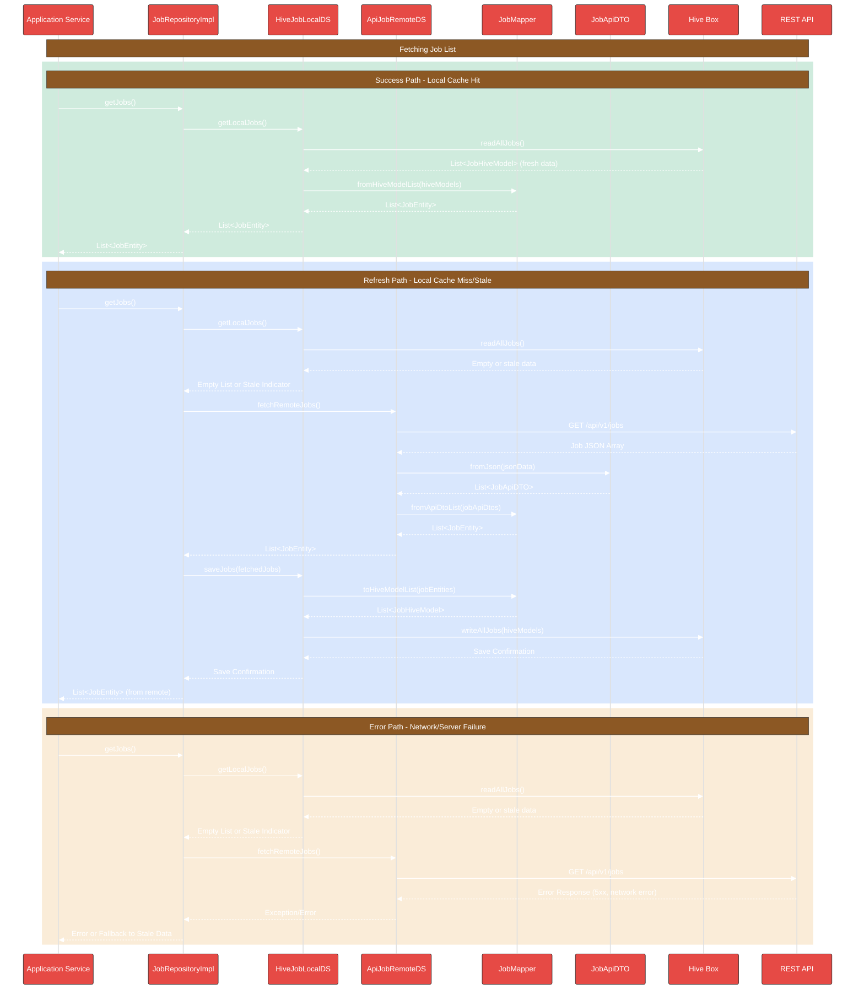

# Job Data Layer Flow

This document details the data flow architecture for the Job feature in DocJet Mobile.

## Job Feature Architecture Overview

The following diagram illustrates the components and their relationships for the job feature.

## Job Data Layer Flow

This sequence diagram shows the typical flows when the application requests job data, demonstrating how the repository interacts with local and remote data sources.

## Job Data Layer Components

### JobRepositoryImpl
Orchestrates data operations for Jobs. It decides whether to fetch from the local cache or the remote API, and handles the synchronization between them. Implements the `JobRepositoryInterface`.

### HiveJobLocalDataSourceImpl
Implements the `JobLocalDataSourceInterface`. Responsible for interacting with the local persistence layer (Hive). Uses `JobMapper` to convert between `JobEntity` and `JobHiveModel`.

### ApiJobRemoteDataSourceImpl
Implements the `JobRemoteDataSourceInterface`. Responsible for communicating with the backend REST API (`/api/v1/jobs`) using an HTTP client. Uses `JobApiDTO` for parsing API responses and `JobMapper` for converting between `JobApiDTO` and `JobEntity`.

### JobMapper
Bidirectional mapper that handles transformations between:
- `JobEntity` (domain) and `JobHiveModel` (local persistence)
- `JobEntity` (domain) and `JobApiDTO` (API communication)

### JobApiDTO
Data Transfer Object specifically for API communication. Mirrors the API's JSON structure and handles serialization/deserialization.

### Hive Box
The Hive database box used for local storage.

### REST API
The backend endpoint providing job data.

## Implementation Status & TODOs

This section tracks the current implementation status of components in the Jobs feature.

### Implemented Components
- ✅ Job Entity (domain/entities/job.dart)
- ✅ JobRepository Interface (domain/repositories/job_repository.dart)
- ✅ JobLocalDataSource Interface (data/datasources/job_local_data_source.dart)
- ✅ HiveJobLocalDataSourceImpl (data/datasources/hive_job_local_data_source_impl.dart)
- ✅ JobHiveModel (data/models/job_hive_model.dart)
- ✅ JobRemoteDataSource Interface (data/datasources/job_remote_data_source.dart)
- ✅ ApiJobRemoteDataSourceImpl (data/datasources/api_job_remote_data_source_impl.dart)
- ✅ Basic JobMapper (for Hive models only) (data/mappers/job_mapper.dart)
- ✅ JobApiDTO (data/models/job_api_dto.dart)

### TODO Components
- ❌ **HIGH PRIORITY** - JobRepositoryImpl implementation (data/repositories/job_repository_impl.dart)
  - Should orchestrate between local and remote data sources
  - Implement caching strategy (freshness policy, offline support)
  - Handle proper error cases and fallback strategies

- ❌ **MEDIUM PRIORITY** - Extend JobMapper with API DTO support
  - Add fromApiDto/toApiDto methods
  - Add list mapping methods for ApiDTO

- ❌ **LOW PRIORITY** - Pagination support in RemoteDataSource
  - Add pagination parameters to API calls
  - Implement pagination state tracking

- ❌ **LOW PRIORITY** - Network connectivity detection
  - Add network state detection before API calls
  - Implement offline-first behavior

### Implementation Notes
- ApiJobRemoteDataSourceImpl currently maps JSON directly to Job entities in _mapJsonToJob
- No freshness policy is implemented yet (deciding when local data is stale)
- No explicit error recovery strategy implemented for network failures 