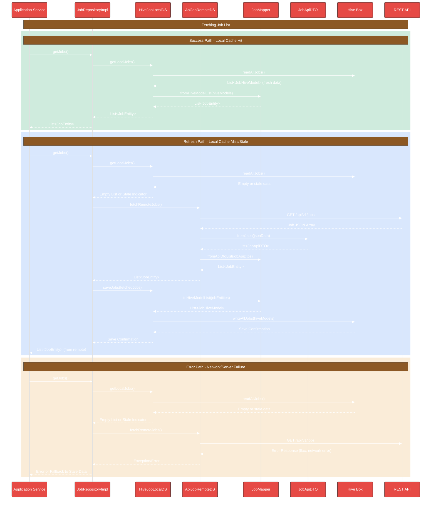

# Job Data Layer Flow

This document details the data flow architecture for the Job feature in DocJet Mobile.

## Job Feature Architecture Overview

The following diagram illustrates the components and their relationships for the job feature.

## Job Data Layer Flow

This sequence diagram shows the typical flows when the application requests job data, demonstrating how the repository interacts with local and remote data sources.

## Job Creation, Update, and Sync Flow

This sequence diagram illustrates the data flow for creating new jobs, updating existing jobs, and synchronizing pending changes with the backend.

```mermaid
%%{init: {'theme': 'base', 'themeVariables': { 
  'primaryColor': '#E64A45', 
  'primaryTextColor': '#fff', 
  'primaryBorderColor': '#222', 
  'lineColor': '#4285F4', 
  'secondaryColor': '#0F9D58', 
  'tertiaryColor': '#9E9E9E',
  'actorLineColor': '#e0e0e0',
  'noteBkgColor': '#8C5824',      
  'noteTextColor': '#fff'       
}}}%%
sequenceDiagram
    participant AppSvc as Application Service
    participant JobRepo as JobRepositoryImpl
    participant LocalDS as HiveJobLocalDS
    participant RemoteDS as ApiJobRemoteDS
    participant Mapper as JobMapper
    participant UUID as UUID Generator
    participant Hive as Hive Box
    participant API as REST API
    participant FileSystem as File System

    %% Job Creation Flow
    rect rgb(15, 157, 88, 0.2)
    Note over AppSvc, API: Job Creation - Local First
    AppSvc->>JobRepo: createJob(audioFilePath, text)
    JobRepo->>UUID: Generate UUID for new job
    UUID-->>JobRepo: new localId
    JobRepo->>JobRepo: Create Job entity with:<br/>- localId<br/>- serverId=null<br/>- SyncStatus.pending
    JobRepo->>Mapper: toHiveModel(jobEntity)
    Mapper-->>JobRepo: JobHiveModel
    JobRepo->>LocalDS: saveJobHiveModel(hiveModel)
    LocalDS->>Hive: Save to Hive Box (keyed by localId)
    Hive-->>LocalDS: Save Confirmation
    LocalDS-->>JobRepo: Save Confirmation
    JobRepo-->>AppSvc: Job entity (with localId)
    end
    
    %% Job Update Flow
    rect rgb(230, 77, 69, 0.2)
    Note over AppSvc, API: Job Update - Local First
    AppSvc->>JobRepo: updateJob(jobId, updates)
    JobRepo->>LocalDS: getJobHiveModel(jobId)
    LocalDS->>Hive: Read from Hive Box
    Hive-->>LocalDS: JobHiveModel
    LocalDS-->>JobRepo: JobHiveModel
    JobRepo->>JobRepo: Update job data and set SyncStatus.pending
    JobRepo->>LocalDS: saveJobHiveModel(updatedModel)
    LocalDS->>Hive: Save to Hive Box (keyed by localId)
    Hive-->>LocalDS: Save Confirmation
    LocalDS-->>JobRepo: Save Confirmation
    JobRepo-->>AppSvc: Updated Job entity
    end
    
    %% Job Deletion Flow
    rect rgb(241, 156, 31, 0.2)
    Note over AppSvc, API: Job Deletion - Local First
    AppSvc->>JobRepo: deleteJob(jobId)
    JobRepo->>LocalDS: getJobHiveModel(jobId)
    LocalDS->>Hive: Read from Hive Box
    Hive-->>LocalDS: JobHiveModel
    JobRepo->>JobRepo: Set SyncStatus.pendingDeletion
    JobRepo->>LocalDS: saveJobHiveModel(updatedModel)
    LocalDS->>Hive: Save to Hive Box (keyed by localId)
    Hive-->>LocalDS: Save Confirmation
    LocalDS-->>JobRepo: Save Confirmation
    JobRepo-->>AppSvc: Success response
    end
    
    %% Sync Pending Jobs Flow
    rect rgb(66, 133, 244, 0.2)
    Note over AppSvc, API: Sync Pending Jobs - Every 15 Seconds
    AppSvc->>JobRepo: syncPendingJobs()
    JobRepo->>LocalDS: getJobsToSync()
    LocalDS->>Hive: Query for SyncStatus.pending AND SyncStatus.pendingDeletion
    Hive-->>LocalDS: List<JobHiveModel> (both types)
    LocalDS-->>JobRepo: List<JobHiveModel>
    JobRepo->>Mapper: fromHiveModelList(pendingJobModels)
    Mapper-->>JobRepo: List<JobEntity>
    
    loop For each pending job
        alt Job has SyncStatus.pending
            JobRepo->>JobRepo: Check serverId field
            
            alt serverId == null (New Job)
                JobRepo->>RemoteDS: createJob(jobEntity)
                RemoteDS->>API: POST /api/v1/jobs with audio upload
                API-->>RemoteDS: Job JSON with server ID
                RemoteDS-->>JobRepo: Job entity with serverId assigned
                
                JobRepo->>Mapper: toHiveModel(syncedJob)
                Mapper-->>JobRepo: JobHiveModel with serverId
                JobRepo->>LocalDS: saveJobHiveModel(syncedModel)
                LocalDS->>Hive: Save updated job (still keyed by localId)
                Hive-->>LocalDS: Save Confirmation
                
                JobRepo->>LocalDS: updateJobSyncStatus(localId, SyncStatus.synced)
                LocalDS->>Hive: Update sync status
                Hive-->>LocalDS: Update Confirmation
                
            else serverId != null (Update)
                JobRepo->>RemoteDS: updateJob(job.serverId, updates)
                RemoteDS->>API: PATCH/PUT /api/v1/jobs/{serverId}
                API-->>RemoteDS: Updated Job JSON
                RemoteDS-->>JobRepo: Updated Job entity
                
                JobRepo->>Mapper: toHiveModel(syncedJob)
                Mapper-->>JobRepo: JobHiveModel
                JobRepo->>LocalDS: saveJobHiveModel(syncedModel)
                LocalDS->>Hive: Save updated job (still keyed by localId)
                Hive-->>LocalDS: Save Confirmation
                
                JobRepo->>LocalDS: updateJobSyncStatus(localId, SyncStatus.synced)
                LocalDS->>Hive: Update sync status
                Hive-->>LocalDS: Update Confirmation
            end
            
        else Job has SyncStatus.pendingDeletion
            alt serverId != null
                JobRepo->>RemoteDS: deleteJob(job.serverId)
                RemoteDS->>API: DELETE /api/v1/jobs/{serverId}
            else serverId == null (local-only job)
                Note over JobRepo: Skip API call for jobs never synced to server
            end
            
            API-->>RemoteDS: Success response
            RemoteDS-->>JobRepo: Success
            
            JobRepo->>LocalDS: deleteJob(job.localId)
            LocalDS->>Hive: Delete from Hive Box
            Hive-->>LocalDS: Delete Confirmation
            
            alt Job has audioFilePath
                JobRepo->>FileSystem: deleteFile(audioFilePath)
                alt File Deletion Success
                    FileSystem-->>JobRepo: Success
                else File Deletion Error
                    FileSystem-->>JobRepo: Error (logged but not fatal)
                end
            end
        end
        
        alt API Error/Network Error
            API-->>RemoteDS: Error response
            RemoteDS-->>JobRepo: Throws exception
            JobRepo->>LocalDS: updateJobSyncStatus(localId, SyncStatus.error)
            LocalDS->>Hive: Update status to error
            Hive-->>LocalDS: Update Confirmation
            LocalDS-->>JobRepo: Update Confirmation
        end
    end
    
    JobRepo-->>AppSvc: Sync completion (Success/Failure)
    end
    
    %% Server-Side Deletion Detection
    rect rgb(142, 68, 173, 0.2)
    Note over AppSvc, API: Server-Side Deletion Detection
    AppSvc->>JobRepo: getJobs() (refresh)
    JobRepo->>RemoteDS: fetchJobs()
    RemoteDS->>API: GET /api/v1/jobs
    API-->>RemoteDS: List of current jobs
    RemoteDS-->>JobRepo: List<JobEntity> with serverIds
    
    JobRepo->>LocalDS: getSyncedJobs()
    LocalDS->>Hive: Query jobs with SyncStatus.synced and serverId != null
    Hive-->>LocalDS: List<JobHiveModel>
    LocalDS-->>JobRepo: List<JobHiveModel>
    
    JobRepo->>JobRepo: Find jobs with serverId not in server response
    
    loop For each job missing from server
        JobRepo->>LocalDS: deleteJob(job.localId)
        LocalDS->>Hive: Delete from Hive Box
        Hive-->>LocalDS: Delete Confirmation
        
        alt Job has audioFilePath
            JobRepo->>FileSystem: deleteFile(audioFilePath)
            alt File Deletion Success
                FileSystem-->>JobRepo: Success
            else File Deletion Error
                FileSystem-->>JobRepo: Error (logged but not fatal)
            end
        end
    end
    
    JobRepo->>LocalDS: saveJobHiveModels(serverJobs)
    LocalDS->>Hive: Save/update jobs from server (keyed by localId)
    Hive-->>LocalDS: Save Confirmation
    
    JobRepo-->>AppSvc: List<JobEntity>
    end
```

> **Note:** This diagram represents the desired target architecture we're working toward. Some flows (particularly deletion handling) are not yet implemented.

## Job Data Layer Components

### JobRepositoryImpl
Orchestrates data operations for Jobs. It decides whether to fetch from the local cache or the remote API, and handles the synchronization between them. Implements the `JobRepositoryInterface`.

### HiveJobLocalDataSourceImpl
Implements the `JobLocalDataSourceInterface`. Responsible for interacting with the local persistence layer (Hive). Uses `JobMapper` to convert between `JobEntity` and `JobHiveModel`.

### ApiJobRemoteDataSourceImpl
Implements the `JobRemoteDataSourceInterface`. Responsible for communicating with the backend REST API (`/api/v1/jobs`) using an HTTP client. Uses `JobApiDTO` for parsing API responses and `JobMapper` for converting between `JobApiDTO` and `JobEntity`. Also handles syncing individual pending jobs to the API.

### JobMapper
Bidirectional mapper that handles transformations between:
- `JobEntity` (domain) and `JobHiveModel` (local persistence)
- `JobEntity` (domain) and `JobApiDTO` (API communication)

### JobApiDTO
Data Transfer Object specifically for API communication. Mirrors the API's JSON structure and handles serialization/deserialization.

### Hive Box
The Hive database box used for local storage.

### REST API
The backend endpoint providing job data. Assumed to support GET for fetching, and POST/PUT/PATCH for creating/updating individual jobs via `syncJob`.

## Implementation Status & TODOs

This section tracks the current implementation status of components in the Jobs feature.

### Implemented Components
- ✅ Job Entity (lib/features/jobs/domain/entities/job.dart)
- ✅ JobRepository Interface (lib/features/jobs/domain/repositories/job_repository.dart)
- ✅ JobLocalDataSource Interface (lib/features/jobs/data/datasources/job_local_data_source.dart)
- ✅ HiveJobLocalDataSourceImpl (lib/features/jobs/data/datasources/hive_job_local_data_source_impl.dart)
- ✅ JobHiveModel (lib/features/jobs/data/models/job_hive_model.dart)
- ✅ JobRemoteDataSource Interface (lib/features/jobs/data/datasources/job_remote_data_source.dart)
- ✅ ApiJobRemoteDataSourceImpl (lib/features/jobs/data/datasources/api_job_remote_data_source_impl.dart)
- ✅ Basic JobMapper (for Hive models only) (lib/features/jobs/data/mappers/job_mapper.dart)
- ✅ JobApiDTO (lib/features/jobs/data/models/job_api_dto.dart)
- ✅ SyncStatus enum (lib/features/jobs/domain/entities/sync_status.dart)
- ✅ **COMPLETED** - Server-side deletion detection

### TODO Components
- ✅ **EXISTING NEEDS UPDATE** - JobRepositoryImpl (lib/features/jobs/data/repositories/job_repository_impl.dart)
  - File exists but needs enhancement
  - ⚠️ **IN PROGRESS** - Implement `syncPendingJobs` using the defined Sync Strategy.
  - Add support for syncing pending jobs when connectivity is restored (Trigger mechanism TBD)

- ✅ **COMPLETED** - Extend JobMapper with API DTO support (lib/features/jobs/data/mappers/job_mapper.dart)
  - Implemented `fromApiDto` and `toApiDto`
  - Implemented `fromApiDtoList`
  - ✅ **COMPLETED** - Skipped `toApiDtoList` as likely not needed for batch updates

- ✅ **COMPLETED** - Implement JobStatus enum for type-safe status handling
  - ✅ **COMPLETED** - Create `JobStatus` enum in domain layer
  - ✅ **COMPLETED** - Update `Job`, `JobHiveModel`, and `JobApiDTO` to use the enum
  - ✅ **COMPLETED** - Update `JobMapper` to handle conversion between different status formats
  - ✅ **COMPLETED** - Update any business logic that depends on job status

- ❌ **LOW PRIORITY** - Pagination support in RemoteDataSource
  - Add pagination parameters to API calls
  - Implement pagination state tracking

- ❌ **LOW PRIORITY** - Network connectivity detection
  - Add network state detection before API calls
  - Implement offline-first behavior

### Implementation Notes
- ApiJobRemoteDataSourceImpl currently maps JSON directly to Job entities in _mapJsonToJob
- No freshness policy is implemented yet (deciding when local data is stale)
- No explicit error recovery strategy implemented for network failures
- ✅ **COMPLETED** - Added SyncStatus enum tracking to JobHiveModel
- ✅ **COMPLETED** - Implemented getJobsToSync and updateJobSyncStatus methods in JobLocalDataSource

### Current Implementation Progress

✅ **COMPLETED** - The latest implementation adds support for sync status tracking and timestamp handling:

1. ✅ **COMPLETED** - Updated `JobLocalDataSource` interface to include timestamp methods:
   - Added `Future<DateTime?> getLastFetchTime();` - Returns when data was last fetched from remote
   - Added `Future<void> saveLastFetchTime(DateTime time);` - Records when data was fetched

2. ✅ **COMPLETED** - Implemented these methods in `HiveJobLocalDataSourceImpl`:
   - Store fetch timestamp in Hive using a dedicated key
   - Handle null cases and type errors for first-time access
   - Ensure UTC consistency in timestamp handling

3. ✅ **COMPLETED** - Added support for sync status tracking:
   - Created SyncStatus enum (pending/synced/error)
   - Extended JobHiveModel with syncStatus field
   - Added getJobsToSync and updateJobSyncStatus methods to JobLocalDataSource
   - Implemented methods in HiveJobLocalDataSourceImpl with robust error handling

### Sync Strategy

This section details the comprehensive synchronization strategy for jobs, covering creation, updates, deletions, and conflict handling.

#### Core Principles

1. **Server Authority ("Server Wins")**: 
   - The server is the ultimate source of truth
   - After initial sync, server data always overwrites local data
   - No conflict detection or resolution needed - server response is accepted as-is

2. **Offline-First Creation/Updates**:
   - New jobs are created locally first with client-generated UUID
   - Job updates are applied locally first
   - Both are marked with `SyncStatus.pending` until synced

#### Sync Process Details

1. **Triggering:** 
   - The `JobRepositoryImpl.syncPendingJobs()` method is called every 15 seconds initially
   - Repository doesn't trigger itself - external timer/service calls it
   - Future: May add triggers on network reconnect, app foregrounding, etc.

2. **Identify Pending:** 
   - Repository requests all records with `SyncStatus.pending` from `JobLocalDataSource`
   - No batching or prioritization - all pending jobs are processed in one go

3. **Sync Logic:**
   - Repository iterates through pending jobs one by one
   - For each job, it checks the `serverId` field to determine if it's new or an update
   - **New Job Flow** (`serverId == null`, `SyncStatus.pending`):
     * Calls `JobRemoteDataSource.createJob(job)`
     * Sends job with client-generated `localId`
     * Receives response with server-assigned `serverId`
     * Saves both IDs (never overwriting `localId`)
   - **Update Job Flow** (`serverId != null`, `SyncStatus.pending`):
     * Calls `JobRemoteDataSource.updateJob(job.serverId, updates)`
     * Sends only changed fields to avoid unnecessary updates
   - **Delete Job Flow** (`SyncStatus.pendingDeletion`):
     * Calls `JobRemoteDataSource.deleteJob(job.serverId ?? job.localId)`
     * Job remains in local DB until API confirms deletion

4. **Success Handling:**
   - Repository saves server response data locally, updating `serverId` if needed
   - Never overwrites `localId` (client UUID)
   - Updates `syncStatus = SyncStatus.synced`
   - For deleted jobs, removes from local DB after successful API deletion

5. **Error Handling:**
   - Sets `syncStatus = SyncStatus.error` on network/server errors
   - Job will be retried on next sync cycle
   - No exponential backoff in initial implementation

#### Server-Side Deletion Handling

When fetching jobs from the server:
1. Repository gets full list of jobs from API
2. Compares with local jobs that have `syncStatus.synced` (ignoring pending ones)
3. Any jobs previously synced but missing from API response are considered deleted by server
4. These jobs are immediately deleted locally (including associated audio files)
5. This is appropriate because jobs are ephemeral processing entities with natural end-of-life

**IMPORTANT: Jobs with `SyncStatus.pending` or `SyncStatus.pendingDeletion` are intentionally ignored during this check.** This prevents accidental deletion of jobs that have been created locally but not yet synced to the server, ensuring no data loss occurs before the job has a chance to be synchronized.

#### Audio File Management

1. Audio files are stored locally when jobs are created
2. Files remain on device as long as their associated job exists
3. When a job is deleted (either locally initiated or server-detected), its audio file is also deleted
4. No separate caching policy or expiration - audio lifecycle is 100% tied to job lifecycle

#### Required Changes

*   Extend `JobHiveModel` with:
    * `localId` field (UUID, generated client-side, never changes)
    * `serverId` field (nullable until first sync, assigned by server)
*   Add corresponding mapping in `JobMapper`
*   Add `uuid` package dependency for generating UUIDs for new jobs
*   Implement job deletion flow in Repository and DataSources (using `SyncStatus.pendingDeletion`)
*   Add audio file deletion when jobs are removed
*   Update `JobEntity` to support dual-ID system

### TDD Implementation Plan

This bottom-up implementation plan follows Test-Driven Development principles, focusing on isolated components first.

#### Level 1: Zero Dependencies (Isolated Components)

1. ✅ **COMPLETED** - Add `uuid` package:
   - RED: Write test verifying UUID generation works
   - GREEN: Add package to pubspec.yaml, run pub get
   - REFACTOR: Ensure tests are clean and meaningful

2. ✅ **COMPLETED** - Use existing FileSystem service:
   - RED: Write tests verifying FileSystem interaction
   - GREEN: Ensure we can use the existing implementation
   - REFACTOR: Clean up tests

3. ✅ **COMPLETED** - Update `SyncStatus` enum:
   - RED: Write tests expecting the new `pendingDeletion` value
   - GREEN: Add the value to enum, run code generation
   - REFACTOR: Ensure enum has clear documentation

#### Level 2: Basic Models

4. ✅ **COMPLETED** - Update `JobEntity` and `JobHiveModel`:
   - RED: Write tests for dual-ID support (`localId` and `serverId`)
   - GREEN: Add fields, run code generation
   - REFACTOR: Ensure good default values

5. ✅ **COMPLETED** - Update `JobMapper`:
   - RED: Write tests for mapping between dual-ID models
   - GREEN: Update mapper implementation
   - REFACTOR: Ensure consistent mapping

#### Level 3: DataSource Layer

6. ✅ **COMPLETED** - Update `JobLocalDataSource` interface:
   - RED: Write tests for new methods (getSyncedJobs, deleteJob)
   - GREEN: Add interface methods
   - REFACTOR: Ensure clear documentation

7. ✅ **COMPLETED** - Update `HiveJobLocalDataSourceImpl`:
   - RED: Write tests for implementation of new methods
   - GREEN: Implement methods
   - REFACTOR: Ensure robust error handling

#### Level 4: Repository Layer

8. ✅ **COMPLETED** - Update `JobRepositoryImpl` constructor:
   - RED: Write tests expecting FileSystem dependency
   - GREEN: Add parameter to constructor
   - REFACTOR: Ensure defaults for backward compatibility

9. ✅ **COMPLETED** - Implement `createJob` method:
   - RED: Write tests covering UUID generation, status setting
   - GREEN: Implement method
   - REFACTOR: Ensure proper error handling

10. ✅ **COMPLETED** - Implement `updateJob` method:
    - RED: Write tests for proper status updates
    - GREEN: Implement method
    - REFACTOR: Clean up implementation

11. ✅ **COMPLETED** - Implement `deleteJob` method:
    - RED: Write tests for setting pendingDeletion status
    - GREEN: Implement method to mark jobs for deletion locally
    - REFACTOR: Ensure clean error handling

12. ✅ **COMPLETED** - Update `syncPendingJobs` method:
    - RED: Write tests for all sync scenarios (new/update/delete) using dual-ID system
    - GREEN: Implement logic for each case
    - REFACTOR: Extract common code into helper methods

13. ✅ **COMPLETED** - Add server-side deletion detection to `getJobs`:
    - RED: Write tests for comparing server vs local data
    - GREEN: Implement detection and deletion logic
    - REFACTOR: Ensure clean error handling

14. ✅ **COMPLETED** - Implement test file for deleteJob functionality:
    - Write unit tests for `test/features/jobs/data/repositories/job_repository_impl/delete_job_test.dart`
    - Test all scenarios (delete synced job, delete unsynced job, handle errors)
    - Validate proper status setting logic for marked deletions

#### Level 5: Integration Testing

15. ❌ **TODO** - Create integration tests:
    - Create workflow tests covering the full job lifecycle
    - Test edge cases and error scenarios
    - Verify correct interaction between components

### Implementation Notes (April 2023)

During our implementation of the job synchronization system, we made several key architecture decisions:

1. **Individual Job Synchronization**: Instead of using a batch sync approach, we now process jobs individually with clear operation paths for:
   - Creating new jobs (serverId == null)
   - Updating existing jobs (serverId != null)
   - Deleting jobs (syncStatus == pendingDeletion)

2. **Audio File Cleanup**: We've integrated the FileSystem service to properly manage audio file resources:
   - When a job is deleted (either locally or server-initiated), its audio file is also deleted
   - The file deletion errors are logged but non-fatal to allow sync to proceed

3. **Error Handling**: We've improved error handling with:
   - Per-job error state tracking
   - Graceful failure that doesn't abort the entire sync process
   - Detailed logging for all sync operations

4. **Dual-ID System**: We've fully implemented the dual-ID approach:
   - localId: Client-generated UUID that never changes
   - serverId: Server-assigned ID after first successful sync

5. **Sync Status Tracking**: We've updated our sync status enum to properly track:
   - pending: Local changes awaiting sync
   - synced: Successfully synchronized with server
   - error: Sync failed for this job
   - pendingDeletion: Marked for deletion on next sync

6. **Server-side Deletion Detection**: We've implemented the logic to detect jobs deleted on the server:
   - When fetching from remote, we compare server IDs with locally synced jobs
   - Jobs that exist locally (with synced status) but aren't returned by the server are deleted
   - We properly ignore pending jobs during this check to prevent data loss

7. **Delete Job Implementation**: We've completed the local deletion marking functionality:
   - Jobs are marked with syncStatus.pendingDeletion instead of being immediately deleted
   - This enables offline-first deletion with eventual consistency
   - The actual deletion happens during the sync process for both local and remote persistence
   - Both synced (with serverId) and unsynced jobs are handled correctly

All tests are now passing for this Job feature, including comprehensive test coverage for the delete functionality. 