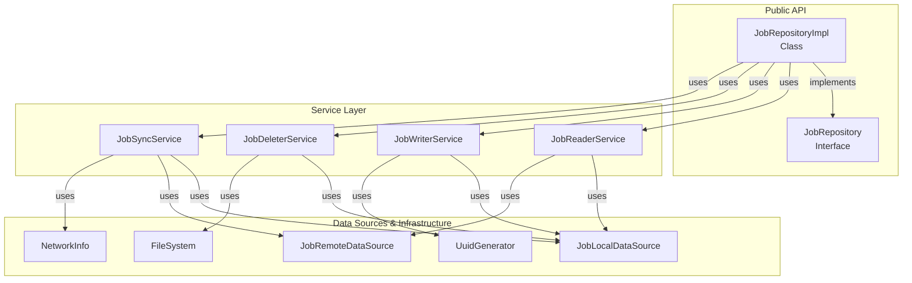

# JobRepository Refactoring Plan - Hard Bob Style

## Problem Statement

The current `JobRepository` is a fucking monolith implementation with way too many responsibilities. It's like having Wags handle investor relations, trader psych, and office maintenance - one entity with too many fucking hats. Here's what's wrong:

- **Bloated Implementation**: Single massive class handling read, write, delete, and sync operations
- **Excessive Comments**: Verbose documentation that bloats the file
- **Poor Type Safety**: Using `Map<String, dynamic>` instead of proper types
- **Unclear ID Contracts**: Doesn't make explicit which ID to use (localId vs serverId)
- **Poor Testability**: Testing the whole repository requires complex mocking hell

## Improved Architecture

We'll split this fucker into a single clean interface and specialized service components with clear, focused responsibilities.



## Key Architecture Principles

1. **Single Public Interface**: 
   - `JobRepository` remains the only public interface with all operations
   - No interface explosion, no unnecessary abstraction

2. **Specialized Service Classes**:
   - Implementation details split into focused service classes
   - Each service handles one aspect (read/write/delete/sync)
   - Services are proper components, not implementation details
   - Direct dependency injection for better testability

3. **Improved Testability**:
   - Each service can be tested in isolation
   - Fewer dependencies to mock per test class
   - Clear separation of concerns in the tests

4. **Clean Dependency Management**:
   - Services get their dependencies directly
   - No complex dependency wiring through the repository

## JobRepository Interface

```dart
/// Manages job data including local persistence, remote sync, and CRUD operations
abstract class JobRepository {
  /// FETCHING OPERATIONS
  
  /// Fetches all jobs for current user
  /// Returns right(jobs) on success or left(failure) on error
  Future<Either<Failure, List<Job>>> getJobs();

  /// Fetches single job by its localId
  /// Returns right(job) if found or left(failure) if not
  Future<Either<Failure, Job>> getJobById(String localId);

  /// WRITE OPERATIONS
  
  /// Creates new job with audio file and optional text
  /// Returns right(job) on success with localId assigned
  Future<Either<Failure, Job>> createJob({
    required String audioFilePath,
    String? text,
  });

  /// Updates existing job by localId with specified changes
  /// Returns right(job) with updated values on success
  Future<Either<Failure, Job>> updateJob({
    required String localId,
    required JobUpdateData updates,
  });
  
  /// DELETE OPERATIONS
  
  /// Marks job for deletion by localId
  /// Returns right(unit) on success
  /// Job is deleted locally after next successful sync
  Future<Either<Failure, Unit>> deleteJob(String localId);
  
  /// SYNC OPERATIONS
  
  /// Syncs all pending jobs with remote server
  /// Processes creates, updates, and deletions
  /// Returns right(unit) when sync process completes
  Future<Either<Failure, Unit>> syncPendingJobs();

  /// Syncs a single job with remote server
  /// Returns right(job) with updated state from server
  Future<Either<Failure, Job>> syncSingleJob(Job job);
}
```

## Implementation Details

### JobRepositoryImpl

```dart
/// Main implementation of JobRepository that delegates to specialized services
class JobRepositoryImpl implements JobRepository {
  final JobReaderService _readerService;
  final JobWriterService _writerService;
  final JobDeleterService _deleterService;
  final JobSyncService _syncService;
  
  JobRepositoryImpl({
    required JobReaderService readerService,
    required JobWriterService writerService,
    required JobDeleterService deleterService,
    required JobSyncService syncService,
  }) : 
    _readerService = readerService,
    _writerService = writerService,
    _deleterService = deleterService,
    _syncService = syncService;
  
  // Read operations
  @override
  Future<Either<Failure, List<Job>>> getJobs() => _readerService.getJobs();
  
  @override
  Future<Either<Failure, Job>> getJobById(String localId) => 
      _readerService.getJobById(localId);
  
  // Write operations
  @override
  Future<Either<Failure, Job>> createJob({
    required String audioFilePath, 
    String? text
  }) => _writerService.createJob(audioFilePath: audioFilePath, text: text);
  
  @override
  Future<Either<Failure, Job>> updateJob({
    required String localId,
    required JobUpdateData updates,
  }) => _writerService.updateJob(localId: localId, updates: updates);
  
  // Delete operations
  @override
  Future<Either<Failure, Unit>> deleteJob(String localId) => 
      _deleterService.deleteJob(localId);
  
  // Sync operations
  @override
  Future<Either<Failure, Unit>> syncPendingJobs() => _syncService.syncPendingJobs();
  
  @override
  Future<Either<Failure, Job>> syncSingleJob(Job job) => _syncService.syncSingleJob(job);
}
```

### JobReaderService

```dart
/// Service class for job read operations
class JobReaderService {
  final JobLocalDataSource _localDataSource;
  final JobRemoteDataSource _remoteDataSource;
  
  JobReaderService(this._localDataSource, this._remoteDataSource);
  
  Future<Either<Failure, List<Job>>> getJobs() async {
    try {
      // Get local jobs
      final localJobs = await _localDataSource.getJobs();
      
      // Logic to determine if fresh enough or if remote fetch needed
      // ...
      
      return Right(localJobs);
    } on Exception catch (e) {
      return Left(CacheFailure());
    }
  }
  
  Future<Either<Failure, Job>> getJobById(String localId) async {
    try {
      final job = await _localDataSource.getJobById(localId);
      return Right(job);
    } on Exception catch (e) {
      return Left(CacheFailure());
    }
  }
  
  Future<Either<Failure, List<Job>>> getJobsByStatus(SyncStatus status) async {
    try {
      final jobs = await _localDataSource.getJobsByStatus(status);
      return Right(jobs);
    } on Exception catch (e) {
      return Left(CacheFailure());
    }
  }
}
```

### JobWriterService

```dart
/// Service class for job write operations
class JobWriterService {
  final JobLocalDataSource _localDataSource;
  final UuidGenerator _uuidGenerator;
  
  JobWriterService(this._localDataSource, this._uuidGenerator);
  
  Future<Either<Failure, Job>> createJob({
    required String audioFilePath,
    String? text,
  }) async {
    try {
      final localId = _uuidGenerator.generate();
      
      final job = Job(
        localId: localId,
        serverId: null,
        text: text,
        audioFilePath: audioFilePath,
        syncStatus: SyncStatus.pending,
        createdAt: DateTime.now(),
      );
      
      await _localDataSource.saveJob(job);
      return Right(job);
    } on Exception catch (e) {
      return Left(CacheFailure());
    }
  }
  
  Future<Either<Failure, Job>> updateJob({
    required String localId,
    required JobUpdateData updates,
  }) async {
    try {
      final jobResult = await _localDataSource.getJobById(localId);
      
      // Apply updates to job
      final updatedJob = jobResult.copyWith(
        text: updates.text ?? jobResult.text,
        status: updates.status ?? jobResult.status,
        syncStatus: SyncStatus.pending, // Mark as needing sync
      );
      
      await _localDataSource.saveJob(updatedJob);
      return Right(updatedJob);
    } on Exception catch (e) {
      return Left(CacheFailure());
    }
  }
  
  Future<Either<Failure, Unit>> updateJobSyncStatus({
    required String localId,
    required SyncStatus status,
  }) async {
    try {
      final jobResult = await _localDataSource.getJobById(localId);
      final updatedJob = jobResult.copyWith(syncStatus: status);
      await _localDataSource.saveJob(updatedJob);
      return Right(unit);
    } on Exception catch (e) {
      return Left(CacheFailure());
    }
  }
}
```

### JobDeleterService

```dart
/// Service class for job deletion operations
class JobDeleterService {
  final JobLocalDataSource _localDataSource;
  final FileSystem _fileSystem;
  
  JobDeleterService(this._localDataSource, this._fileSystem);
  
  Future<Either<Failure, Unit>> deleteJob(String localId) async {
    try {
      final jobResult = await _localDataSource.getJobById(localId);
      
      // Mark for deletion by updating sync status
      final jobToDelete = jobResult.copyWith(
        syncStatus: SyncStatus.pendingDeletion,
      );
      
      await _localDataSource.saveJob(jobToDelete);
      return Right(unit);
    } on Exception catch (e) {
      return Left(CacheFailure());
    }
  }
  
  Future<Either<Failure, Unit>> permanentlyDeleteJob(String localId) async {
    try {
      final jobResult = await _localDataSource.getJobById(localId);
      
      // Delete the job from local storage
      await _localDataSource.deleteJob(localId);
      
      // Delete associated audio file if exists
      if (jobResult.audioFilePath != null) {
        try {
          await _fileSystem.deleteFile(jobResult.audioFilePath!);
        } catch (e) {
          // Log but don't fail the operation if file deletion fails
          // Audio file deletion is a non-critical operation
        }
      }
      
      return Right(unit);
    } on Exception catch (e) {
      return Left(CacheFailure());
    }
  }
}
```

### JobSyncService

```dart
/// Service class for job synchronization with remote server
class JobSyncService {
  final JobLocalDataSource _localDataSource;
  final JobRemoteDataSource _remoteDataSource;
  final NetworkInfo _networkInfo;
  final FileSystem _fileSystem;
  
  JobSyncService({
    required JobLocalDataSource localDataSource,
    required JobRemoteDataSource remoteDataSource,
    required NetworkInfo networkInfo,
    required FileSystem fileSystem,
  }) : 
    _localDataSource = localDataSource,
    _remoteDataSource = remoteDataSource,
    _networkInfo = networkInfo,
    _fileSystem = fileSystem;
  
  Future<Either<Failure, Unit>> syncPendingJobs() async {
    // Check network connectivity
    if (!await _networkInfo.isConnected) {
      return Left(NetworkFailure());
    }
    
    try {
      // Get all pending jobs (new or updated)
      final pendingJobs = await _localDataSource.getJobsByStatus(SyncStatus.pending);
      
      // Get all jobs pending deletion
      final deletionJobs = await _localDataSource.getJobsByStatus(SyncStatus.pendingDeletion);
      
      // Process each pending job
      for (final job in pendingJobs) {
        final syncResult = await syncSingleJob(job);
        // Error handling done in syncSingleJob
      }
      
      // Process each job pending deletion
      for (final job in deletionJobs) {
        if (job.serverId != null) {
          // Delete on server if it exists there
          try {
            await _remoteDataSource.deleteJob(job.serverId!);
          } catch (e) {
            // Log error but continue with other operations
          }
        }
        
        // Always delete locally regardless of server success
        await _permanentlyDeleteJob(job.localId);
      }
      
      return Right(unit);
    } on Exception catch (e) {
      return Left(ServerFailure());
    }
  }
  
  Future<Either<Failure, Job>> syncSingleJob(Job job) async {
    try {
      if (job.serverId == null) {
        // This is a new job, create on server
        final remoteJob = await _remoteDataSource.createJob(job);
        
        // Update local job with server details
        final updatedJob = job.copyWith(
          serverId: remoteJob.serverId,
          syncStatus: SyncStatus.synced,
        );
        
        // Save updated job locally
        await _localDataSource.saveJob(updatedJob);
        
        return Right(updatedJob);
      } else {
        // This is an existing job, update on server
        final remoteJob = await _remoteDataSource.updateJob(job);
        
        // Update local job with sync status
        final updatedJob = job.copyWith(
          syncStatus: SyncStatus.synced,
        );
        
        await _localDataSource.saveJob(updatedJob);
        
        return Right(updatedJob);
      }
    } catch (e) {
      // If sync fails, mark job with error status
      final errorJob = job.copyWith(syncStatus: SyncStatus.error);
      await _localDataSource.saveJob(errorJob);
      
      return Left(ServerFailure());
    }
  }
  
  // Internal helper method to delete job permanently
  Future<void> _permanentlyDeleteJob(String localId) async {
    try {
      final job = await _localDataSource.getJobById(localId);
      
      // Delete the job from local storage
      await _localDataSource.deleteJob(localId);
      
      // Delete associated audio file if exists
      if (job.audioFilePath != null) {
        try {
          await _fileSystem.deleteFile(job.audioFilePath!);
        } catch (e) {
          // Log but don't fail the operation if file deletion fails
        }
      }
    } catch (e) {
      // Log but continue with sync operations
    }
  }
}
```

## JobUpdateData Class

```dart
/// Model class for job updates with explicit fields
class JobUpdateData {
  final String? text;
  final JobStatus? status;
  final String? serverId; // Added for sync operations
  // Add other fields that can be updated
  
  const JobUpdateData({
    this.text,
    this.status,
    this.serverId,
  });
  
  // Optional utility to check if instance has any non-null fields
  bool get hasChanges => text != null || status != null || serverId != null;
}
```

## File Organization

```
lib/
  features/
    jobs/
      data/
        repositories/
          job_repository.dart             # Interface definition
          job_repository_impl.dart        # Main implementation
        services/
          job_reader_service.dart         # Reader implementation
          job_writer_service.dart         # Writer implementation
          job_deleter_service.dart        # Deleter implementation
          job_sync_service.dart           # Sync implementation
        models/
          job_update_data.dart            # Update model
```

## Dependency Injection Setup

```dart
// Register data sources
sl.registerLazySingleton<JobLocalDataSource>(() => HiveJobLocalDataSourceImpl(
  sl<HiveInterface>(),
));

sl.registerLazySingleton<JobRemoteDataSource>(() => ApiJobRemoteDataSourceImpl(
  sl<HttpClient>(),
));

// Register services
sl.registerLazySingleton(() => JobReaderService(
  sl<JobLocalDataSource>(),
  sl<JobRemoteDataSource>(),
));

sl.registerLazySingleton(() => JobWriterService(
  sl<JobLocalDataSource>(),
  sl<UuidGenerator>(),
));

sl.registerLazySingleton(() => JobDeleterService(
  sl<JobLocalDataSource>(),
  sl<FileSystem>(),
));

sl.registerLazySingleton(() => JobSyncService(
  localDataSource: sl<JobLocalDataSource>(),
  remoteDataSource: sl<JobRemoteDataSource>(),
  networkInfo: sl<NetworkInfo>(),
  fileSystem: sl<FileSystem>(),
));

// Register repository
sl.registerLazySingleton<JobRepository>(() => JobRepositoryImpl(
  readerService: sl<JobReaderService>(),
  writerService: sl<JobWriterService>(),
  deleterService: sl<JobDeleterService>(),
  syncService: sl<JobSyncService>(),
));
```

## Migration Strategy

1. **Create Service Classes**: Define all service classes in their own files
2. **Create Data Models**: Define `JobUpdateData` and other models
3. **Update JobRepository Interface**: Clean up the interface with logical grouping
4. **Implement JobRepositoryImpl**: Simple implementation delegating to services
5. **Update DI Container**: Register services and repository with dependencies
6. **Update Usage Sites**: Replace Map<String, dynamic> with JobUpdateData, etc.
7. **Comprehensive Testing**: Test each service in isolation with focused unit tests

## TODO List - Hard Bob Style

-   [x] **1. Setup:**
    -   [x] Create file structure under `lib/features/jobs/data/services/`
    -   [x] Create `JobUpdateData` model (`lib/features/jobs/data/models/job_update_data.dart`)
-   [x] **2. JobReaderService:**
    -   [x] Create `job_reader_service.dart`
    -   [x] Create `job_reader_service_test.dart`
    -   [x] Write tests for `getJobs` (steal from `get_jobs_test.dart`)
    -   [x] Implement `getJobs`
    -   [x] Write tests for `getJobById` (steal from `get_jobs_test.dart`)
    -   [x] Implement `getJobById`
    -   [x] Write tests for `getJobsByStatus` (new functionality)
    -   [x] Implement `getJobsByStatus`
-   [x] **3. JobWriterService:**
    -   [x] Create `job_writer_service.dart`
    -   [x] Create `job_writer_service_test.dart`
    -   [x] Write tests for `createJob` (steal from `create_job_test.dart`)
    -   [x] Implement `createJob`
    -   [x] Write tests for `updateJob` (steal from `update_job_test.dart`)
    -   [x] Implement `updateJob`
    -   [x] Write tests for `updateJobSyncStatus` (new functionality)
    -   [x] Implement `updateJobSyncStatus`
-   [x] **4. JobDeleterService:**
    -   [x] Create `job_deleter_service.dart`
    -   [x] Create `job_deleter_service_test.dart`
-   [x] **5. JobSyncService:**
    -   [x] Create `job_sync_service.dart`
    -   [x] Create `job_sync_service_test.dart`
    -   [x] Write tests for `syncPendingJobs` (steal from `sync_pending_jobs_test.dart`) --> *Partially done - one test written*
    -   [x] Implement `syncPendingJobs` and `_permanentlyDeleteJob` helper
    -   [x] Write tests for `syncSingleJob` (steal from `sync_pending_jobs_test.dart`) --> *Success and Error cases done*
    -   [x] Implement `syncSingleJob`
-   [ ] **6. JobRepository:**
    -   [ ] Clean up `JobRepository` interface (`lib/features/jobs/data/repositories/job_repository.dart`)
    -   [ ] Implement `JobRepositoryImpl` (`lib/features/jobs/data/repositories/job_repository_impl.dart`)
    -   [ ] Write/Update tests for `JobRepositoryImpl` (verify delegation)
-   [ ] **7. Integration & Cleanup:**
    -   [ ] Update DI Container (`lib/core/injection/injection.dart` or similar)
    -   [ ] Update Usage Sites (This is the tricky part - find where `JobRepository` is used)
    -   [ ] Run `dart analyze --fatal-infos` and fix ALL issues
    -   [ ] Run `./scripts/list_failed_tests.sh` and ensure all tests pass
    -   [ ] Final review of the plan document (`jobrepo_refactor.md`)
    -   [ ] Hard Bob Commit

## Testing Approach

### Unit Testing Service Classes

```dart
group('JobReaderService', () {
  test('getJobs returns jobs from local data source when available', () {
    // Setup mocks for local data source only
    // Much simpler than testing the entire repository
  });
  
  test('getJobById returns job from local data source', () {
    // Clean, focused test for single responsibility
  });
});
```

### Unit Testing Sync Service

```dart
group('JobSyncService', () {
  test('syncPendingJobs processes pending and deletion jobs separately', () {
    // Mock local and remote data sources
    // Test sync workflow
  });
  
  test('syncSingleJob handles server failure by setting error status', () {
    // Test error handling logic in isolation
  });
});
```

### Integration Testing Repository

```dart
group('JobRepositoryImpl', () {
  test('delegates operations to appropriate services', () {
    // Verify proper delegation to mocked services
  });
});
```

## Advantages Over Previous Design

1. **Proper Service Layer**: Services are real components, not implementation details
2. **Better Testability**: Each service is independently testable
3. **Clean Public API**: Only one interface for consumers to understand
4. **Clean Dependency Management**: Services get their dependencies directly
5. **Improved Organization**: Code split into logical units that can be maintained separately

## Conclusion

This refactoring plan:
1. Breaks down a monolithic implementation into focused service classes with clear responsibilities
2. Maintains a clean single interface for simplicity
3. Improves type safety by using proper models instead of dynamic maps
4. Makes testing simpler and more focused
5. Treats internal components as proper services, not just "helpers"

As Axe says, "It's not just about winning. It's about winning the right way, with strategy and discipline." This refactor gives you clean code organization with proper service isolation and testability. 
