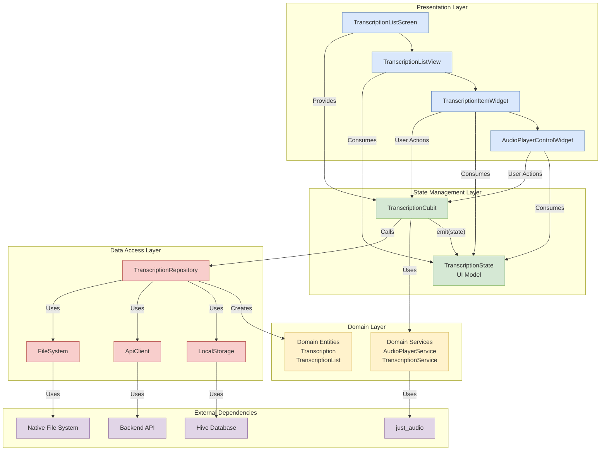
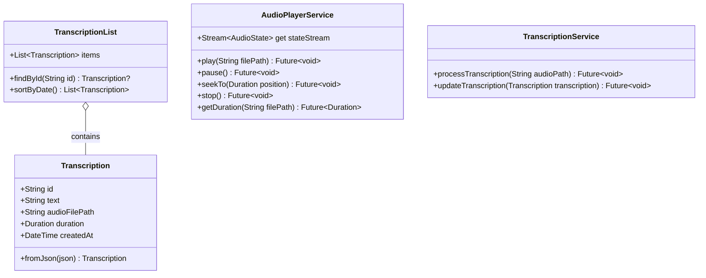
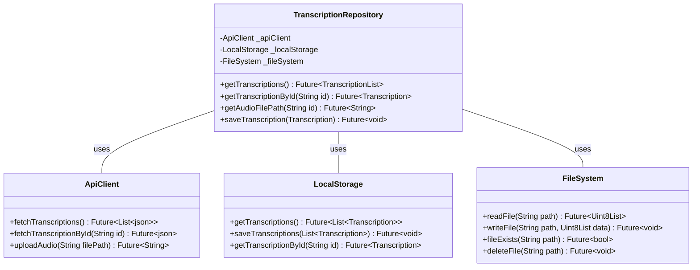
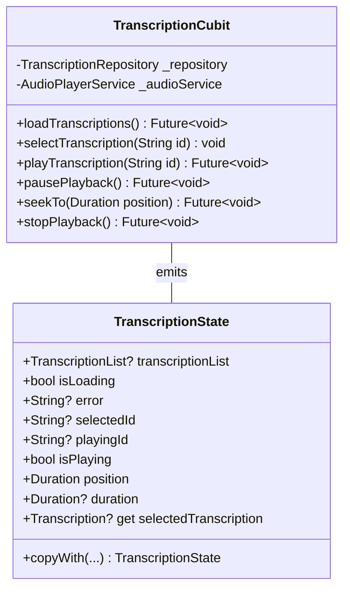
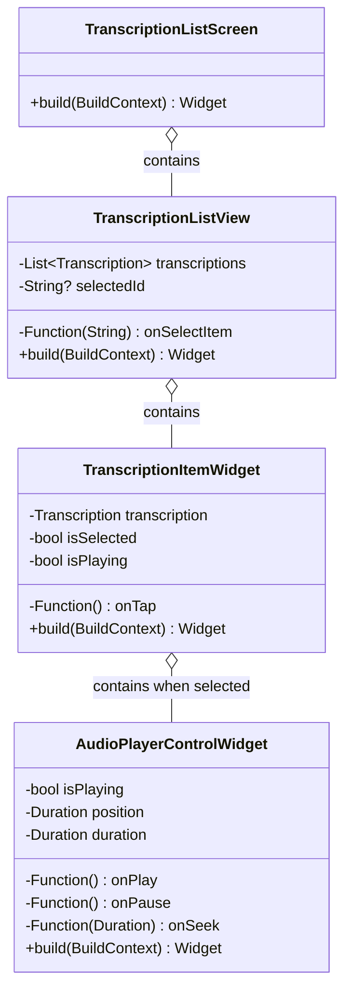
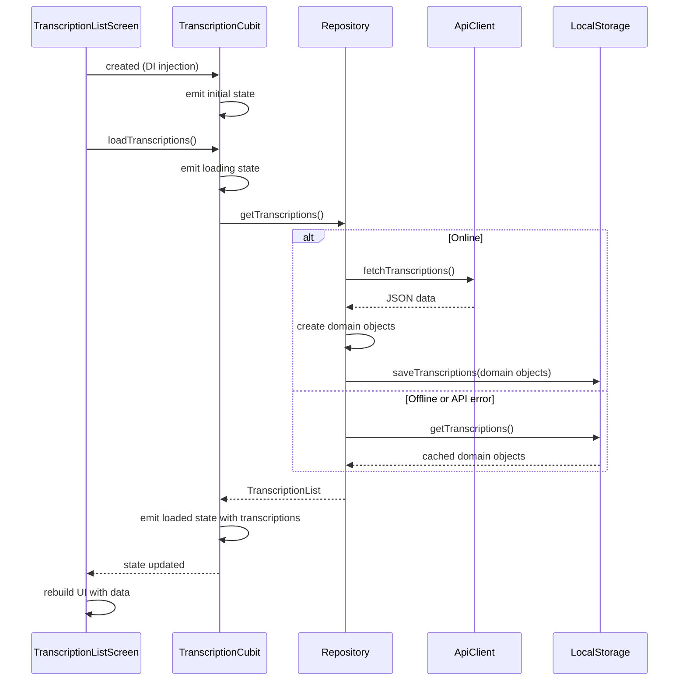
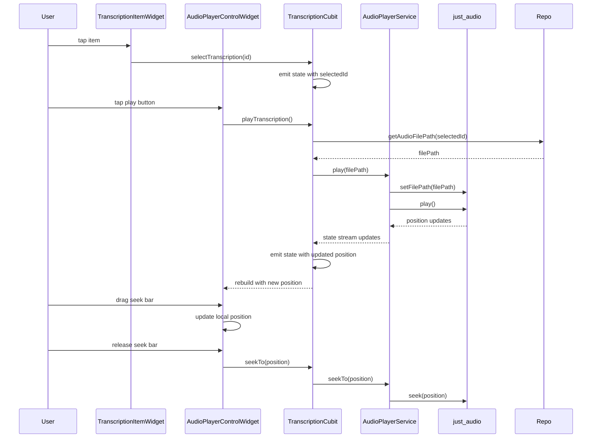
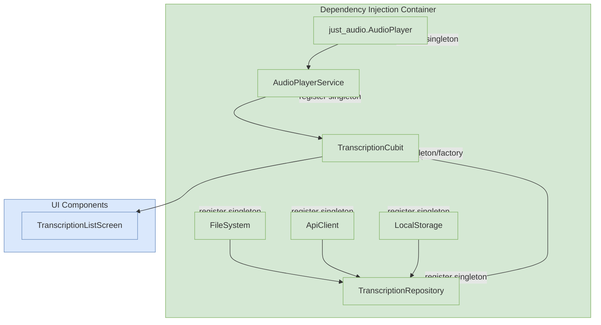

# Transcription Audio Player: Complete Architecture

This document provides a comprehensive view of the entire Transcription Audio Player architecture, showing all components and their relationships.

## System Overview

## Detailed Component Breakdown

### Domain Layer (Business Logic)

### Data Access Layer (Data Sources)

### State Management Layer

### Presentation Layer (UI)

## Data Flow Diagrams

### Application Startup

### Audio Playback

## Dependency Injection

## Key Insights

1. **Clean Separation of Concerns**:
   - Domain layer contains pure business logic and entities
   - Data layer handles data access and persistence
   - State management layer bridges domain and UI
   - Presentation layer focuses only on displaying state

2. **Unidirectional Data Flow**:
   - User actions flow down to the Cubit
   - Cubit updates state based on those actions
   - State changes flow back up to the UI
   - UI rebuilds based on new state

3. **Domain-Driven Design**:
   - Repository creates and returns domain objects
   - Business logic operates on domain objects
   - UI displays domain objects but doesn't modify them

4. **Single Source of Truth**:
   - TranscriptionState contains all data needed by the UI
   - No duplicated state across components
   - All state updates go through the Cubit

5. **Testability**:
   - Each component has a single responsibility
   - Dependencies are injected and can be mocked
   - Cubits expose predictable, testable methods
   - UI components are pure functions of their inputs

This architecture provides a scalable foundation for the Transcription Audio Player, with clear boundaries between components and a predictable data flow.

## Implementation Strategy

1. **Start with Domain Entities**:
   - Define Transcription and TranscriptionList classes
   - Implement basic domain logic

2. **Implement Data Access**:
   - Create API client and local storage
   - Implement repository and data sources

3. **Build State Management**:
   - Define TranscriptionState class
   - Implement TranscriptionCubit with core methods

4. **Create UI Components**:
   - Build TranscriptionListView and item widgets
   - Implement audio player controls
   - Connect widgets to Cubit

5. **Wire Everything Together**:
   - Set up dependency injection
   - Register all services and repositories
   - Connect UI to state management 