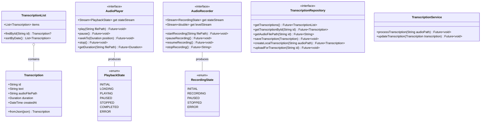
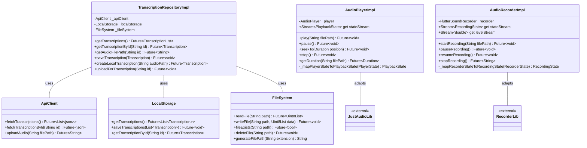
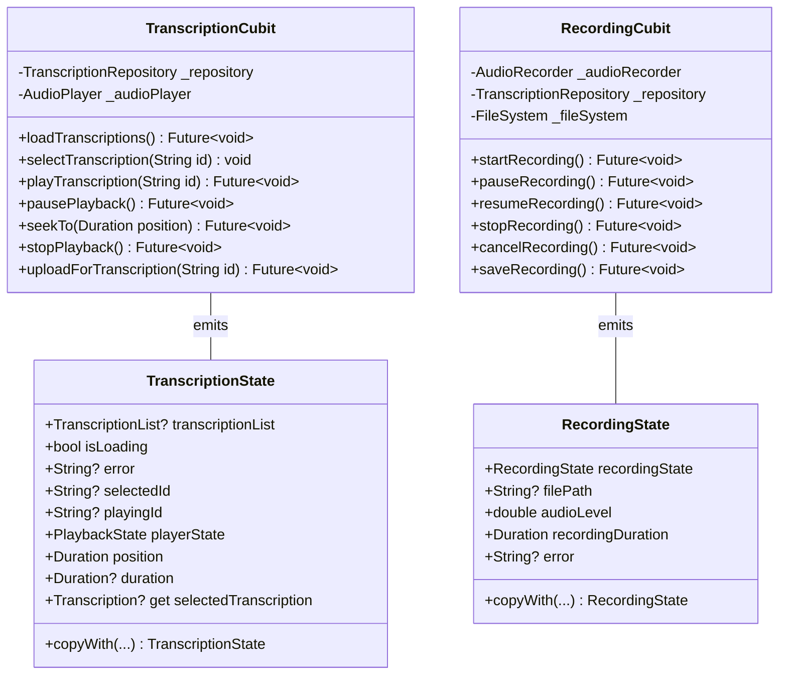
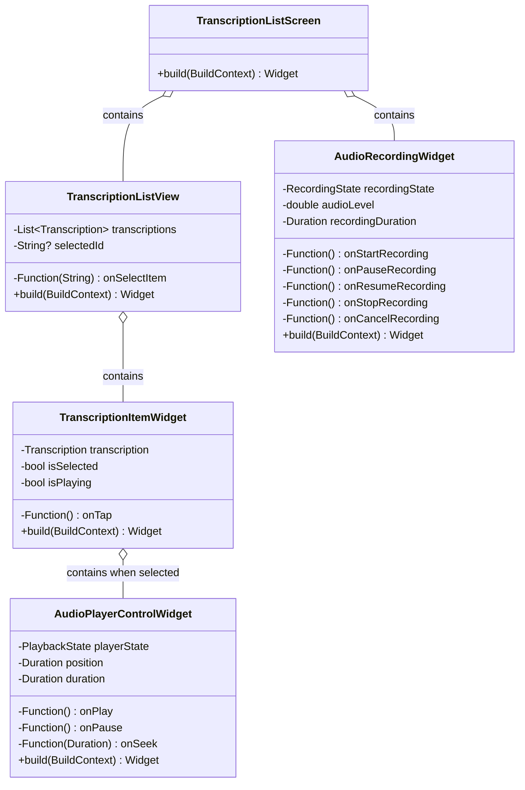
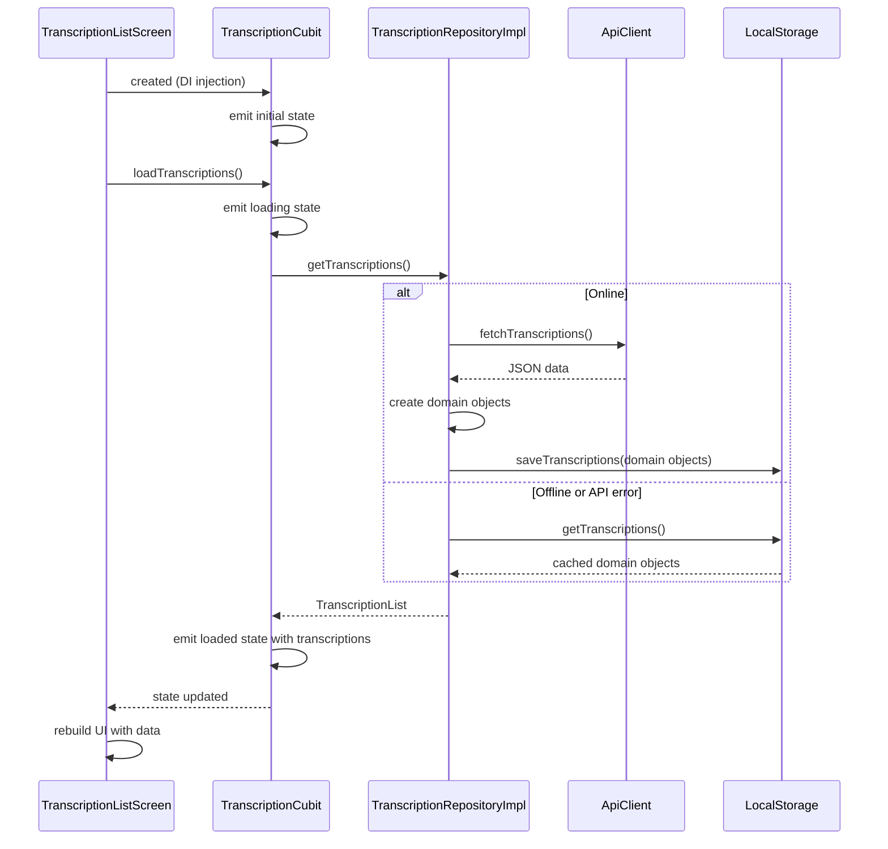
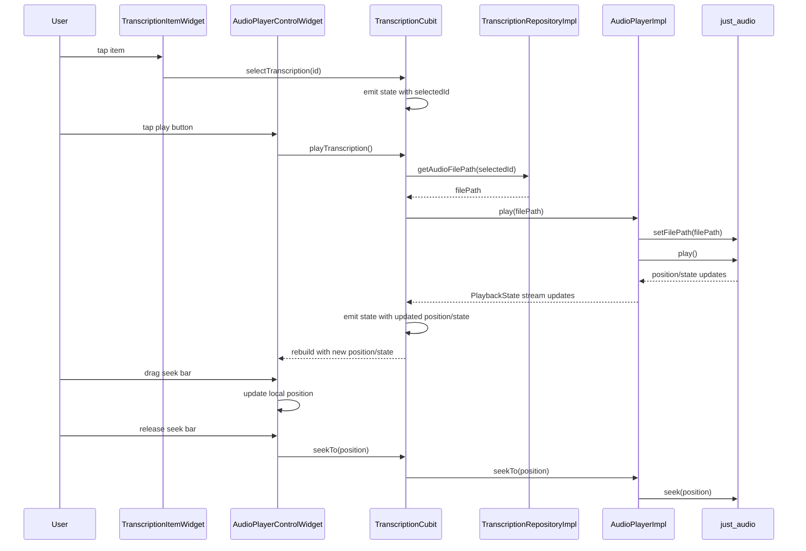
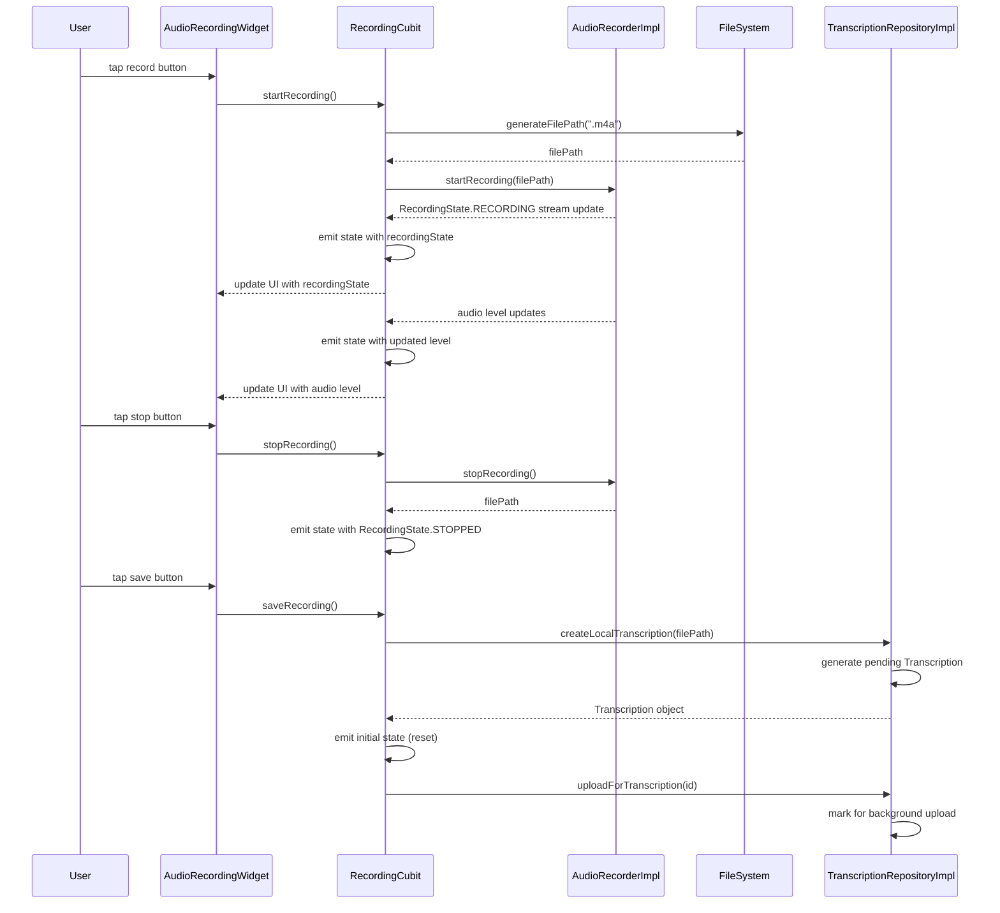
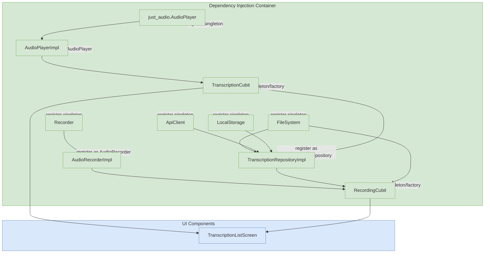

# Transcription Audio Player: Revised Architecture

This document provides a comprehensive view of the Transcription Audio Player architecture, showing all components and their relationships with proper separation of concerns.

## System Overview

```mermaid
graph TB
    %% Main layers of the application
    subgraph Presentation [Presentation Layer]
        direction TB
        Screen[TranscriptionListScreen]
        ListView[TranscriptionListView]
        ItemWidget[TranscriptionItemWidget]
        PlayerWidget[AudioPlayerControlWidget]
        RecordWidget[AudioRecordingWidget]
    end
    
    subgraph StateManagement [State Management Layer]
        direction TB
        ListCubit[TranscriptionCubit]
        RecordCubit[RecordingCubit]
        ListState[TranscriptionState]
        RecordState[RecordingState]
    end
    
    subgraph Domain [Domain Layer]
        direction TB
        Entities[Domain Entities<br>Transcription<br>TranscriptionList]
        Interfaces[Domain Interfaces<br>AudioPlayer<br>AudioRecorder<br>TranscriptionRepository]
        Services[Domain Services<br>TranscriptionService]
    end
    
    subgraph Data [Data Access Layer]
        direction TB
        RepositoryImpl[TranscriptionRepositoryImpl]
        AudioPlayerImpl[AudioPlayerImpl]
        AudioRecorderImpl[AudioRecorderImpl]
        LocalDataSource[LocalStorage]
        RemoteDataSource[ApiClient]
        FileSystem[FileSystem]
    end
    
    subgraph External [External Dependencies]
        direction TB
        JustAudio[just_audio]
        RecorderLib[flutter_sound/record]
        Hive[Hive Database]
        BackendAPI[Backend API]
        NativeFS[Native File System]
    end
    
    %% Connections between components
    Screen --> ListView
    ListView --> ItemWidget
    ItemWidget --> PlayerWidget
    Screen --> RecordWidget
    
    Screen -- Provides --> ListCubit
    Screen -- Provides --> RecordCubit
    ListView -- Consumes --> ListState
    ItemWidget -- Consumes --> ListState
    PlayerWidget -- Consumes --> ListState
    RecordWidget -- Consumes --> RecordState
    
    ItemWidget -- User Actions --> ListCubit
    PlayerWidget -- User Actions --> ListCubit
    RecordWidget -- User Actions --> RecordCubit
    
    ListCubit -- "emit(state)" --> ListState
    RecordCubit -- "emit(state)" --> RecordState
    ListCubit -- Uses --> Interfaces
    RecordCubit -- Uses --> Interfaces
    
    RepositoryImpl -- Implements --> Interfaces
    AudioPlayerImpl -- Implements --> Interfaces
    AudioRecorderImpl -- Implements --> Interfaces
    
    RepositoryImpl -- Creates --> Entities
    RepositoryImpl -- Uses --> LocalDataSource
    RepositoryImpl -- Uses --> RemoteDataSource
    RepositoryImpl -- Uses --> FileSystem
    
    AudioPlayerImpl -- Uses --> JustAudio
    AudioRecorderImpl -- Uses --> RecorderLib
    LocalDataSource -- Uses --> Hive
    RemoteDataSource -- Uses --> BackendAPI
    FileSystem -- Uses --> NativeFS
    
    %% Styling
    classDef presentation fill:#dae8fc,stroke:#6c8ebf,stroke-width:1px
    classDef stateManagement fill:#d5e8d4,stroke:#82b366,stroke-width:1px
    classDef domain fill:#fff2cc,stroke:#d6b656,stroke-width:1px
    classDef data fill:#f8cecc,stroke:#b85450,stroke-width:1px
    classDef external fill:#e1d5e7,stroke:#9673a6,stroke-width:1px
    
    class Screen,ListView,ItemWidget,PlayerWidget,RecordWidget presentation
    class ListCubit,RecordCubit,ListState,RecordState stateManagement
    class Entities,Interfaces,Services domain
    class RepositoryImpl,AudioPlayerImpl,AudioRecorderImpl,LocalDataSource,RemoteDataSource,FileSystem data
    class JustAudio,RecorderLib,Hive,BackendAPI,NativeFS external
```

## Detailed Component Breakdown

### Domain Layer (Pure Business Logic)

### Data Access Layer (Infrastructure Implementations)

### State Management Layer

### Presentation Layer (UI)

## Data Flow Diagrams

### Application Startup

### Audio Playback

### Audio Recording

## Dependency Injection

## Key Architectural Improvements

1. **Proper Separation of Concerns**:
   - Domain layer contains only business logic, entities, and interfaces
   - Audio implementation details (both playback and recording) moved to the Data layer
   - No infrastructure implementation details leak into the Domain layer

2. **Complete Functionality**:
   - Full recording functionality properly represented
   - Clear separation between recording and playback concerns
   - Proper flow for creating new transcriptions

3. **Clean Interfaces at Boundaries**:
   - Domain defines what capabilities are needed through interfaces
   - Data layer implements those interfaces with concrete implementations
   - No direct dependencies on external libraries from Domain or Cubits

4. **Testability**:
   - All Cubits depend only on interfaces
   - Easy to mock AudioPlayer, AudioRecorder and TranscriptionRepository for testing
   - No need to mock external dependencies directly in tests

5. **Minimal Architecture**:
   - No unnecessary abstraction layers
   - Direct, straightforward data flow
   - Interfaces only where they provide real value (at layer boundaries)

This revised architecture maintains proper Clean Architecture principles while eliminating unnecessary complexity. It ensures dependencies point inward toward the Domain layer while keeping the implementation minimal and focused, and now includes the complete recording functionality needed for a transcription application. 