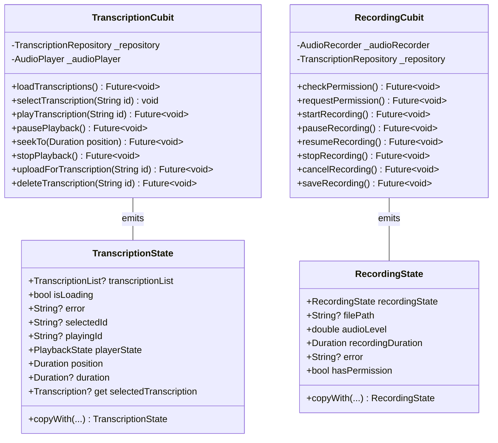
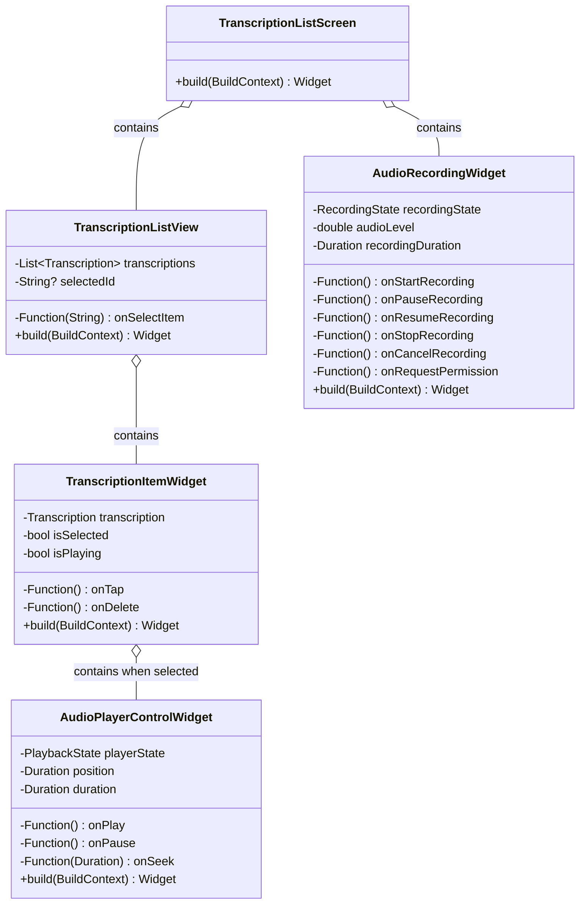
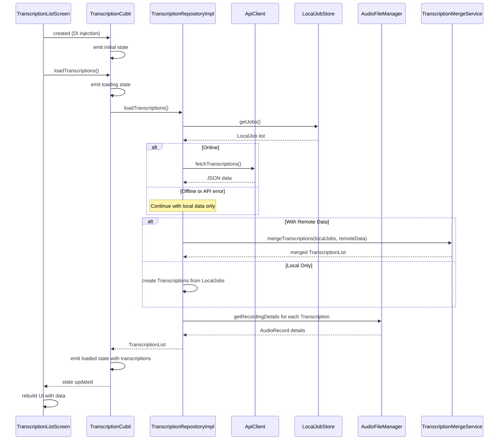
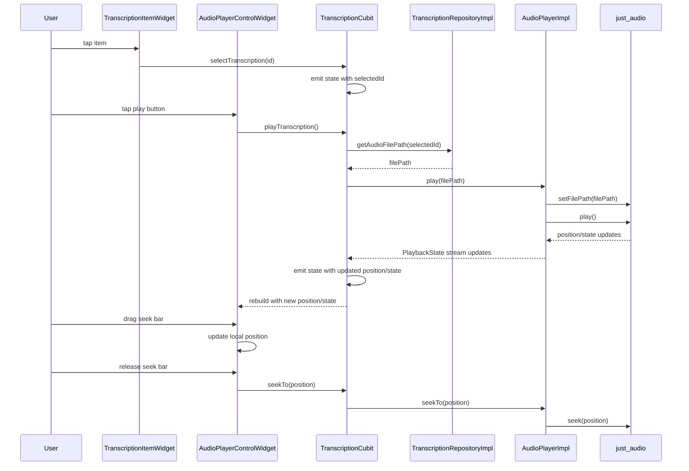
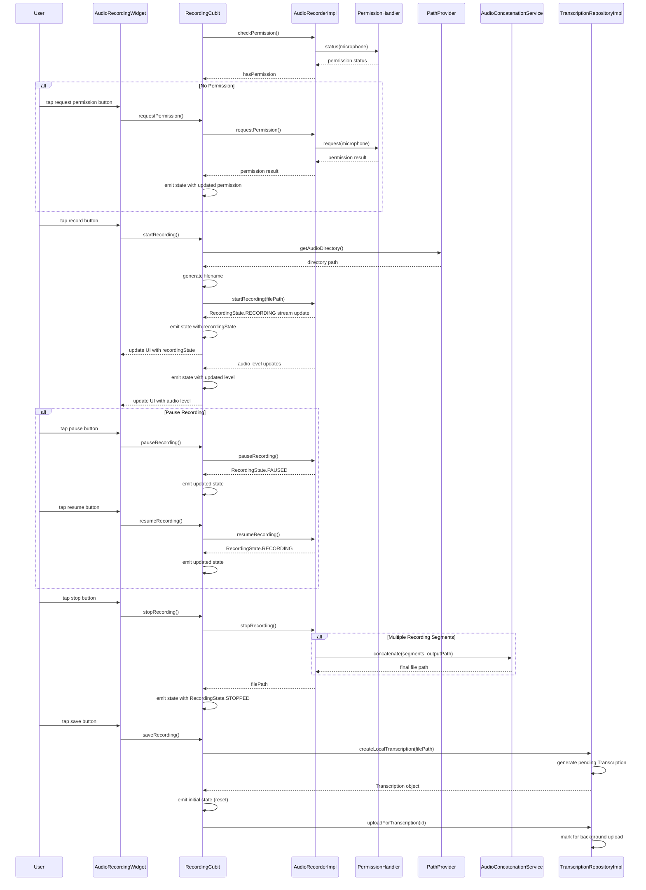
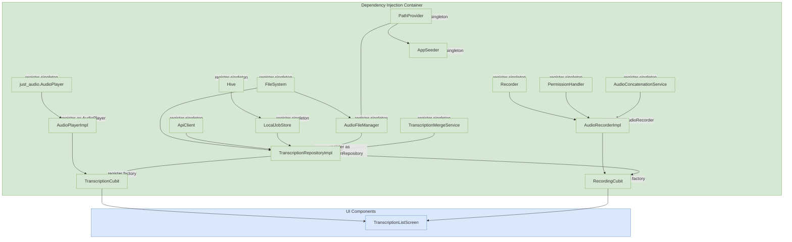

# DocJet Mobile: Revised Architecture

This document provides a comprehensive view of the DocJet Mobile architecture, showing all components and their relationships with proper separation of concerns while preserving valuable infrastructure components.

## System Overview

```mermaid
graph TB
    %% Main layers of the application
    subgraph Presentation [Presentation Layer]
        direction TB
        Screen[TranscriptionListScreen]
        ListView[TranscriptionListView]
        ItemWidget[TranscriptionItemWidget]
        PlayerWidget[AudioPlayerControlWidget]
        RecordWidget[AudioRecordingWidget]
    end
    
    subgraph StateManagement [State Management Layer]
        direction TB
        ListCubit[TranscriptionCubit]
        RecordCubit[RecordingCubit]
        ListState[TranscriptionState]
        RecordState[RecordingState]
    end
    
    subgraph Domain [Domain Layer]
        direction TB
        Entities[Domain Entities<br>Transcription<br>AudioRecord<br>LocalJob]
        Interfaces[Domain Interfaces<br>AudioPlayer<br>AudioRecorder<br>TranscriptionRepository]
        Services[Domain Services<br>TranscriptionService]
        Failures[Error Abstractions<br>Failure hierarchy]
    end
    
    subgraph Data [Data Access Layer]
        direction TB
        RepositoryImpl[TranscriptionRepositoryImpl]
        AudioPlayerImpl[AudioPlayerImpl]
        AudioRecorderImpl[AudioRecorderImpl]
        LocalDataSource[LocalJobStore]
        AudioFileManager[AudioFileManager]
        MergeService[TranscriptionMergeService]
        ConcatService[AudioConcatenationService]
        RemoteDataSource[ApiClient]
    end
    
    subgraph Infrastructure [Infrastructure Layer]
        direction TB
        FileSystem[FileSystem]
        PathProvider[PathProvider]
        PermissionHandler[PermissionHandler]
        AppSeeder[AppSeeder]
    end
    
    subgraph External [External Dependencies]
        direction TB
        JustAudio[just_audio]
        RecorderLib[flutter_sound/record]
        Hive[Hive Database]
        BackendAPI[Backend API]
        NativeFS[Native File System]
    end
    
    %% Connections between components
    Screen --> ListView
    ListView --> ItemWidget
    ItemWidget --> PlayerWidget
    Screen --> RecordWidget
    
    Screen -- Provides --> ListCubit
    Screen -- Provides --> RecordCubit
    ListView -- Consumes --> ListState
    ItemWidget -- Consumes --> ListState
    PlayerWidget -- Consumes --> ListState
    RecordWidget -- Consumes --> RecordState
    
    ItemWidget -- User Actions --> ListCubit
    PlayerWidget -- User Actions --> ListCubit
    RecordWidget -- User Actions --> RecordCubit
    
    ListCubit -- "emit(state)" --> ListState
    RecordCubit -- "emit(state)" --> RecordState
    ListCubit -- Uses --> Interfaces
    RecordCubit -- Uses --> Interfaces
    
    RepositoryImpl -- Implements --> Interfaces
    AudioPlayerImpl -- Implements --> Interfaces
    AudioRecorderImpl -- Implements --> Interfaces
    
    RepositoryImpl -- Creates --> Entities
    RepositoryImpl -- Uses --> LocalDataSource
    RepositoryImpl -- Uses --> RemoteDataSource
    RepositoryImpl -- Uses --> MergeService
    RepositoryImpl -- Uses --> AudioFileManager
    
    AudioRecorderImpl -- Uses --> ConcatService
    AudioPlayerImpl -- Uses --> JustAudio
    AudioRecorderImpl -- Uses --> RecorderLib
    AudioFileManager -- Uses --> FileSystem
    AudioFileManager -- Uses --> PathProvider
    
    LocalDataSource -- Uses --> Hive
    RemoteDataSource -- Uses --> BackendAPI
    FileSystem -- Uses --> NativeFS
    
    AudioRecorderImpl -- Uses --> PermissionHandler
    
    %% Styling
    classDef presentation fill:#dae8fc,stroke:#6c8ebf,stroke-width:1px
    classDef stateManagement fill:#d5e8d4,stroke:#82b366,stroke-width:1px
    classDef domain fill:#fff2cc,stroke:#d6b656,stroke-width:1px
    classDef data fill:#f8cecc,stroke:#b85450,stroke-width:1px
    classDef infrastructure fill:#e1d5e7,stroke:#9673a6,stroke-width:1px
    classDef external fill:#d4d4d4,stroke:#666666,stroke-width:1px
    
    class Screen,ListView,ItemWidget,PlayerWidget,RecordWidget presentation
    class ListCubit,RecordCubit,ListState,RecordState stateManagement
    class Entities,Interfaces,Services,Failures domain
    class RepositoryImpl,AudioPlayerImpl,AudioRecorderImpl,LocalDataSource,RemoteDataSource,AudioFileManager,MergeService,ConcatService data
    class FileSystem,PathProvider,PermissionHandler,AppSeeder infrastructure
    class JustAudio,RecorderLib,Hive,BackendAPI,NativeFS external
```

## Detailed Component Breakdown

### Domain Layer (Pure Business Logic)

```mermaid
classDiagram
    class Transcription {
        +String id
        +String text
        +String audioFilePath
        +Duration duration
        +DateTime createdAt
        +TranscriptionStatus status
        +fromJson(json) Transcription
    }
    
    class AudioRecord {
        +String filePath
        +Duration duration
        +DateTime createdAt
    }
    
    class LocalJob {
        +String id
        +String localFilePath
        +TranscriptionStatus status
        +DateTime createdAt
    }
    
    class TranscriptionList {
        +List~Transcription~ items
        +findById(String id) Transcription?
        +sortByDate() List~Transcription~
    }
    
    class AudioPlayer {
        <<interface>>
        +play(String filePath) Future~void~
        +pause() Future~void~
        +seekTo(Duration position) Future~void~
        +stop() Future~void~
        +getDuration(String filePath) Future~Duration~
        +Stream~PlaybackState~ get stateStream
    }
    
    class AudioRecorder {
        <<interface>>
        +checkPermission() Future~bool~
        +requestPermission() Future~bool~
        +startRecording(String filePath) Future~void~
        +pauseRecording() Future~void~
        +resumeRecording() Future~void~
        +stopRecording() Future~String~
        +Stream~RecordingState~ get stateStream
        +Stream~double~ get levelStream
    }
    
    class TranscriptionRepository {
        <<interface>>
        +getTranscriptions() Future~TranscriptionList~
        +getTranscriptionById(String id) Future~Transcription~
        +getAudioFilePath(String id) Future~String~
        +saveTranscription(Transcription) Future~void~
        +createLocalTranscription(String audioPath) Future~Transcription~
        +uploadForTranscription(String id) Future~void~
        +loadTranscriptions() Future~List~Transcription~~
        +deleteRecording(String filePath) Future~void~
    }
    
    class AudioFileManager {
        <<interface>>
        +listRecordingPaths() Future~List~String~~
        +deleteRecording(String filePath) Future~void~
        +getRecordingDetails(String filePath) Future~AudioRecord~
    }
    
    class LocalJobStore {
        <<interface>>
        +saveJob(LocalJob job) Future~void~
        +getJobs() Future~List~LocalJob~~
        +updateJob(LocalJob job) Future~void~
        +deleteJob(String id) Future~void~
    }
    
    class TranscriptionService {
        +processTranscription(String audioPath) Future~void~
        +updateTranscription(Transcription transcription) Future~void~
    }
    
    class Failure {
        <<abstract>>
        +String message
    }
    
    class ServerFailure {
        +String message
        +int? statusCode
    }
    
    class CacheFailure {
        +String message
    }
    
    class PermissionFailure {
        +String message
    }
    
    class PlaybackState {
        <<enum>>
        INITIAL
        LOADING
        PLAYING
        PAUSED
        STOPPED
        COMPLETED
        ERROR
    }
    
    class RecordingState {
        <<enum>>
        INITIAL
        RECORDING
        PAUSED
        STOPPED
        ERROR
    }
    
    class TranscriptionStatus {
        <<enum>>
        CREATED
        UPLOADING
        PROCESSING
        COMPLETED
        FAILED
    }
    
    TranscriptionList o-- Transcription : contains
    AudioPlayer -- PlaybackState : produces
    AudioRecorder -- RecordingState : produces
    Transcription -- TranscriptionStatus : has status
    ServerFailure --|> Failure : extends
    CacheFailure --|> Failure : extends
    PermissionFailure --|> Failure : extends
    LocalJob -- TranscriptionStatus : has status
    TranscriptionRepository -- Failure : returns
    AudioFileManager -- Failure : returns
    LocalJobStore -- Failure : returns
```

### Data Access Layer (Infrastructure Implementations)

```mermaid
classDiagram
    class TranscriptionRepositoryImpl {
        -ApiClient _apiClient
        -LocalJobStore _localJobStore
        -AudioFileManager _audioFileManager
        -TranscriptionMergeService _mergeService
        +getTranscriptions() Future~TranscriptionList~
        +getTranscriptionById(String id) Future~Transcription~
        +getAudioFilePath(String id) Future~String~
        +saveTranscription(Transcription) Future~void~
        +createLocalTranscription(String audioPath) Future~Transcription~
        +uploadForTranscription(String id) Future~void~
        +loadTranscriptions() Future~List~Transcription~~
        +deleteRecording(String filePath) Future~void~
    }
    
    class AudioPlayerImpl {
        -AudioPlayer _player
        -PathProvider _pathProvider
        +play(String filePath) Future~void~
        +pause() Future~void~
        +seekTo(Duration position) Future~void~
        +stop() Future~void~
        +getDuration(String filePath) Future~Duration~
        +Stream~PlaybackState~ get stateStream
        -_mapPlayerStateToPlaybackState(PlayerState) PlaybackState
    }
    
    class AudioRecorderImpl {
        -FlutterSoundRecorder _recorder
        -PermissionHandler _permissionHandler
        -AudioConcatenationService _concatService
        +checkPermission() Future~bool~
        +requestPermission() Future~bool~
        +startRecording(String filePath) Future~void~
        +pauseRecording() Future~void~
        +resumeRecording() Future~void~
        +stopRecording() Future~String~
        +Stream~RecordingState~ get stateStream
        +Stream~double~ get levelStream
        -_mapRecorderStateToRecordingState(RecorderState) RecordingState
    }
    
    class ApiClient {
        +fetchTranscriptions() Future~List~json~~
        +fetchTranscriptionById(String id) Future~json~
        +uploadAudio(String filePath) Future~String~
        +checkTranscriptionStatus(String id) Future~TranscriptionStatus~
    }
    
    class HiveLocalJobStoreImpl {
        -Box~LocalJob~ _box
        +saveJob(LocalJob job) Future~void~
        +getJobs() Future~List~LocalJob~~
        +updateJob(LocalJob job) Future~void~
        +deleteJob(String id) Future~void~
        +openBox() Future~void~
    }
    
    class AudioFileManagerImpl {
        -FileSystem _fileSystem
        -PathProvider _pathProvider
        -AudioPlayer _audioPlayer
        +listRecordingPaths() Future~List~String~~
        +deleteRecording(String filePath) Future~void~
        +getRecordingDetails(String filePath) Future~AudioRecord~
        -_getRecordDetails(String path) Future~AudioRecord~
    }
    
    class TranscriptionMergeServiceImpl {
        +mergeTranscriptions(List~LocalJob~ localJobs, List~json~ remoteData) List~Transcription~
        -_findMatchingRemoteData(LocalJob job, List~json~ remoteData) json?
        -_createTranscriptionFromJob(LocalJob job, json? remoteData) Transcription
    }
    
    class AudioConcatenationServiceImpl {
        +concatenate(List~String~ filePaths, String outputPath) Future~String~
        -_validateAudioFiles(List~String~ filePaths) Future~void~
        -_performConcatenation(List~String~ filePaths, String outputPath) Future~String~
    }
    
    class IoFileSystem {
        -PathProvider _pathProvider
        +stat(String path) Future~FileStat~
        +fileExists(String path) Future~bool~
        +deleteFile(String path) Future~void~
        +directoryExists(String path) Future~bool~
        +createDirectory(String path, bool recursive) Future~void~
        +listDirectory(String path) Future~List~String~~
        +writeFile(String path, Uint8List bytes) Future~void~
        +readFile(String path) Future~Uint8List~
        -_resolvePath(String inputPath) String
    }
    
    class AppPathProvider {
        +getApplicationDocumentsDirectory() Future~String~
        +getTemporaryDirectory() Future~String~
        +getAudioDirectory() Future~String~
    }
    
    class AppPermissionHandler {
        +request(List~Permission~ permissions) Future~Map~Permission, bool~~
        +status(Permission permission) Future~PermissionStatus~
        +openAppSettings() Future~bool~
    }
    
    class AppSeeder {
        -LocalJobStore _localJobStore
        -FileSystem _fileSystem
        +seedInitialData() Future~void~
        +hasSeededData() Future~bool~
    }

    class JustAudioLib {
        <<external>>
    }
    
    class RecorderLib {
        <<external>>
    }
    
    TranscriptionRepositoryImpl ..|> TranscriptionRepository : implements
    AudioPlayerImpl ..|> AudioPlayer : implements
    AudioRecorderImpl ..|> AudioRecorder : implements
    HiveLocalJobStoreImpl ..|> LocalJobStore : implements
    AudioFileManagerImpl ..|> AudioFileManager : implements
    TranscriptionMergeServiceImpl ..|> TranscriptionMergeService : implements
    AudioConcatenationServiceImpl ..|> AudioConcatenationService : implements
    IoFileSystem ..|> FileSystem : implements
    AppPathProvider ..|> PathProvider : implements
    AppPermissionHandler ..|> PermissionHandler : implements
    
    TranscriptionRepositoryImpl -- ApiClient : uses
    TranscriptionRepositoryImpl -- HiveLocalJobStoreImpl : uses
    TranscriptionRepositoryImpl -- AudioFileManagerImpl : uses
    TranscriptionRepositoryImpl -- TranscriptionMergeServiceImpl : uses
    AudioPlayerImpl -- JustAudioLib : adapts
    AudioRecorderImpl -- RecorderLib : adapts
    AudioRecorderImpl -- AudioConcatenationServiceImpl : uses
    AudioRecorderImpl -- AppPermissionHandler : uses
    AudioFileManagerImpl -- IoFileSystem : uses
    AudioFileManagerImpl -- AppPathProvider : uses
    HiveLocalJobStoreImpl -- Hive : uses
```

### State Management Layer

### Presentation Layer (UI)

## Data Flow Diagrams

### Application Startup

### Audio Playback

### Audio Recording

## Dependency Injection

## Key Architectural Improvements

1. **Proper Separation of Concerns with Specialized Services**:
   - Domain layer contains only business logic, entities, and interfaces
   - Audio implementation details (both playback and recording) moved to the Data layer
   - Specialized services for complex operations (concatenation, merging) maintained
   - Infrastructure layer properly isolates platform concerns

2. **Complete Functionality**:
   - Full recording functionality with proper permission handling
   - Clear separation between recording and playback concerns
   - Proper flow for creating new transcriptions
   - Error handling through Failure abstractions

3. **Clean Interfaces at Boundaries**:
   - Domain defines what capabilities are needed through interfaces
   - Data layer implements those interfaces with concrete implementations
   - No direct dependencies on external libraries from Domain or Cubits

4. **Infrastructure Excellence**:
   - FileSystem, PathProvider, and PermissionHandler abstractions preserved
   - Platform-specific code properly isolated
   - AppSeeder for initialization and testing

5. **Testability**:
   - All Cubits depend only on interfaces
   - Easy to mock AudioPlayer, AudioRecorder and TranscriptionRepository for testing
   - Specialized services can be mocked individually
   - No need to mock external dependencies directly in tests

6. **Minimal Overhead**:
   - No unnecessary abstraction layers
   - Direct, straightforward data flow
   - Interfaces only where they provide real value (at layer boundaries)
   - Specialized services only for genuinely complex operations

This revised architecture maintains proper Clean Architecture principles while keeping valuable specialized services. It ensures dependencies point inward toward the Domain layer while preserving the sophisticated infrastructure components that handle complex platform-specific operations. 