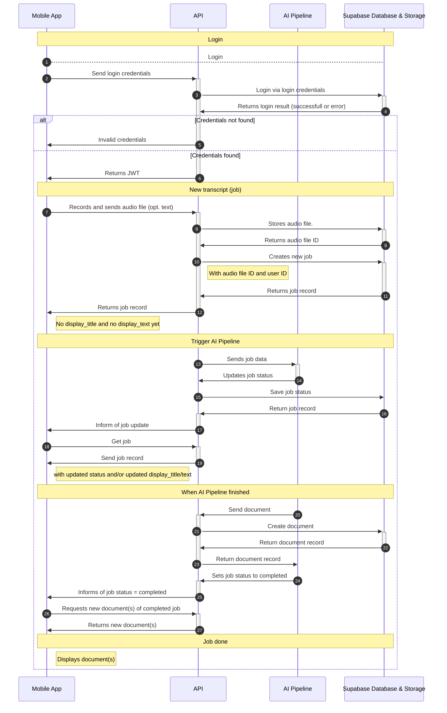

# DocJet System
## **📄 Introduction**

**Project:** DocJet Platform

**Purpose:** DocJet is a platform that leverages AI to help healthcare professionals generate clinical documentation efficiently. The core use case: the doctor speaks, DocJet transcribes and structures the information into a clinical report or document. The user then reviews and copies the output into their hospital information system (HIS).

**Goal:** Record audio → send to API → AI processes and generates document → present result → user copies into HIS

**Authentication:** JWT-based secure access with mandatory API key

---

## **🧭 Platform Overview**

- **DocJet Web App**: Responsive browser app for viewing, copying, and managing generated documents. Optimized for desktop, but does work on mobile. Built with Svelte + SvelteKit.
- **DocJet Mobile App**:
    - Lightweight voice recorder (iOS-first) with minimal job/documents management.
    - Flutter, iOS-first
    - Handles recording/uploading
    - Polls for job status
    - Securely stores JWT and API key for all requests
- **DocJet REST API**: Central API for auth, access and management of job and document data. All client/backend interactions flow through this.
- **Docjet AI Pipeline**: Transcribes audio and generates clinical documents. Updates job records and creates documents via DocJet REST API.
- **DocJet Server**: Hosts the SvelteKit backend, manages jobs and push notifications
- **Supabase Database**: PostgreSQL backend accessed only via the DocJet API. Stores job and document data.

> Note: No backend component, including Supabase, is accessible directly by clients. All access must go through the DocJet API.
> 

---

## **📱 DocJet Mobile App – UX / UI Overview**

### **Audio Recording Interface**

The DocJet Mobile App features a minimal, intuitive audio recording interface optimized for quick and distraction-free input. The goal is to let healthcare professionals record structured clinical notes with as little friction as possible.

- **Main Control:** A central **record button** toggles recording state.
- **States and Actions:**
    - **Start:** User taps the button to begin recording. Timer and waveform display activate.
    - **Pause:** User can tap to pause recording mid-note (e.g., during interruptions).
    - **Resume:** Tapping again resumes recording from the paused state.
    - **End:** A final tap ends the session. The app transitions to preview mode with playback option to verify the recording. There is some icon to return to the pause mode in case the doctor forgot something.
    - **Send:** User confirms and submits the audio for processing (creates a Job).
- **Visual Feedback:**
    - A waveform display provides real-time audio feedback.
    - Elapsed time is shown during recording.
    - Pause/resume animations make state transitions obvious.
- **Additional Features:**
    - Optionally add brief text notes before submission.
    - If offline, the recording is queued locally and synced once online.

---

### **Transkripte List**

- UI title: **"Transkripte"**
- This screen displays a list of recording Jobs, each representing one user recording and its processing status.
- Although the backend entity is a **Job**, the term **"Transkript"** better reflects what is shown to the user: the transcript resulting from their recording.

> Clarification:\
While a Job may result in multiple final Documents, these are not shown in the UI.\
Instead, the app displays metadata and preview text derived from the transcript, which is the first output of the AI pipeline.
> 
- The list is scrollable and shows:
    - **Timestamp** (primary label before transcript is available)
    - **Status badge**: `created`, `submitted`, `transcribing`, `transcribed`, `generating`, `generated`, `completed`, `error`
    - **Progress bar**
    - **display_title** and **display_text** from the transcript

> Note: The term "Transkripte" intentionally abstracts away the underlying 1:n relationship between Jobs and Documents. This simplification improves usability, as users interact with their recordings primarily through the lens of the resulting transcript.
> 

### **Job Interaction**

- Tap on a **completed** entry to:
    - View the transcript
    - Edit or append audio/notes
    - Resubmit (creates a new Job, keeps the original)
    - View list of documents (1 or more) created for this job. List only displays title of documents and link to documents which opens in default mobile browser app.

### **Offline Usage**

- Fully offline job creation
- Unsynced jobs are saved locally (status: `created`)
- Auto-upload in background on connectivity return (status: `submitted`)

### **Update Mechanism**

- Polling the DocJet API
- Silent background refresh via push notifications from DocJet Server

---

## **⚙️ DocJet Mobile App - End-to-End Workflow**



1. **Login**
    - User logs in via the API → receives JWT + refresh token
2. **Audio Upload** (Mobile)
    - User records and uploads audio → Job API endpoint stores audio in S3 → returns job record
    - Job shows up in app with status: `submitted`
3. **Pipeline Trigger**
    - DocJet API ~~Server~~ triggers Pipeline API with job metadata
4. **Pipeline Processing**
    - Transcription → job "status": `transcribing`
    - Transcript generation updates: `status = transcribed`, `display_title`, `display_text,`
    - Document generation → job "status": `generating`
    - Document(s) generated → job "status": `generated`
    - Job API endpoint receives status updates → pushes to mobile app, app updates job status in UI
5. **Finalization**
    - On completion: AI Pipeline creates document(s) via DocJet REST API "documents" endpoint and updates job "status": `completed`
    - On failure: `error_code`, `error_message` populated, job status: `error`
    - Documents available for Mobile App at `/api/v1/jobs/{id}/documents`

**Note:** Retries are automatic (limited attempts). Failures only surfaced after retries are exhausted.

---

---

## **📦 DocJet Mobile App - Relevant Data Structures**

### **Job Table**

| **Field** | **Type** | **Description** |
| --- | --- | --- |
| id | UUID | Job ID |
| status | string | `created`, `submitted`, `transcribing`, `transcribed`, `generating`, `generated`, `completed`, `error` |
| error_code | number | Optional error code if job failed |
| error_message | string | Optional error message if job failed |
| user_id | UUID | Authenticated user ID |
| created_at | timestamp | Timestamp of creation |
| updated_at | timestamp | Timestamp of last update |
| audio_file_path | string | File path to recorded audio file. |
| text | string | Text from Frontend form additional to audio recordihng |
| additional_text | string | Optional extra metadata |
| transcript | string | Generated transcript from recorded audio file |
| display_title | string | Short UI label to identify the Job |
| display_text | string | Transcript snippet shown as preview in the UI |

### **Documents Table**

| **Field** | **Type** | **Description** |
| --- | --- | --- |
| id | UUID | Document ID |
| job_id | UUID | Foreign key to job |
| title | string | Name of document |
| created_at | timestamp | Timestamp of creation |
| … some more fields not currently relevant |  |  |

---

## DocJet Mobile App - Relevant API Calls

### **🔐 Authentication**

All requests to the **DocJet API** require:

1. `Authorization: Bearer <JWT>` – identifies the authenticated user
2. `X-API-Key: <API_KEY>` – **required for all requests**, including auth login and refresh
3. `Content-Type: application/json` – If not noted otherwise below, the Content-Type is  application/json

This dual-token system ensures user identity and service-level trust.

### **`POST /api/v1/auth/login`**

- **Description:** Log in with email/password to get tokens
- **Headers:**
    - `Content-Type: application/json`
    - `X-API-Key: <API_KEY>`
- **Body:**

```
{
  "email": "user@example.com",
  "password": "••••••••"
}
```

- **Response:**

```
{
  "access_token": "...",
  "refresh_token": "...",
  "user_id": "..."
}
```

### **`POST /api/v1/auth/refresh-session`**

- **Description:** Refresh access token
- **Headers:**
    - `Content-Type: application/json`
    - `X-API-Key: <API_KEY>`
- **Body:**

```
{
  "refresh_token": "..."
}
```

- **Response:**

```
{
  "access_token": "...",
  "refresh_token": "..."
}
```

---

### **📤 Jobs API**

### **`GET /api/v1/jobs`**

- **Description:** Fetch all job records for the authenticated user.
- **Headers:**
    - `Authorization: Bearer <JWT>`
    - `X-API-Key: <API_KEY>`
- **Query Parameters:** (Optional - for pagination/filtering, TBD)
    - `limit`: number
    - `offset`: number
    - `status`: string (e.g., "completed")
- **Response:**

```json
{
  "data": [
    {
      "id": "...",
      "user_id": "...",
      "job_status": "completed",
      "error_code": null,
      "error_message": null,
      "created_at": "...",
      "updated_at": "...",
      "text": "...",
      "additional_text": "...",
      "display_title": "...",
      "display_text": "..."
    },
    // ... more job objects
  ],
  "pagination": {
    "limit": 20,
    "offset": 0,
    "total": 50
  }
}
```

### **`POST /api/v1/jobs`**

- **Description:** Create a new job with audio + optional transcript and metadata
- **Headers:**
    - `Authorization: Bearer <JWT>`
    - `X-API-Key: <API_KEY>`
    - `Content-Type: multipart/form-data`
- **Form Data:**
    - `user_id`: string (required)
    - `audio_file`: file (required)
    - `text`: string (optional)
    - `additional_text`: string (optional)
    - **ATTENTION: Hard Bob Note**
    - The 'user_id' field is marked as required here, but the current mobile implementation
    - assumes the backend derives the user ID from the JWT and does NOT send this field
    - in the form data. Verify the backend's actual requirement and update either
    - the spec or the mobile implementation for consistency.
    - **END ATTENTION**
- **Response:**

```json
{
  "data": {
    "id": "...",
    "user_id": "...",
    "job_status": "submitted",
    "created_at": "...",
    "updated_at": "...",
    "text": "...",
    "additional_text": "...",
    "display_title": null,
    "display_text": null
  }
}
```

### **`PATCH /api/v1/jobs/{id}`**

- **Description:** Update job metadata, including transcript and display fields
- **Headers:**
    - `Authorization: Bearer <JWT>`
    - `X-API-Key: <API_KEY>`
    - `Content-Type: application/json`
- **Body:**

```json
{
  "text": "Updated transcript text",
  "display_title": "Short summary",
  "display_text": "Transcript snippet or preview"
}
```

- **Response:**

```json
{
  "data": {
    "id": "...",
    "user_id": "...",
    "job_status": "transcribed",
    "error_code": null,
    "error_message": null,
    "created_at": "...",
    "updated_at": "...",
    "text": "Updated transcript text",
    "display_title": "Short summary",
    "display_text": "Transcript snippet or preview"
  }
}
```

### **`GET /api/v1/jobs/{id}`**

- **Description:** Fetch a single job's status and metadata
- **Headers:**
    - `Authorization: Bearer <JWT>`
    - `X-API-Key: <API_KEY>`
- **Response:**

```json
{
  "data": {
    "id": "...",
    "user_id": "...",
    "job_status": "transcribing",
    "error_code": null,
    "error_message": null,
    "created_at": "...",
    "updated_at": "...",
    "text": "...",
    "additional_text": "...",
    "display_title": "...",
    "display_text": "..."
  }
}
```

---

### **📄 Documents API**

**`GET /api/v1/jobs/{id}/documents`**

- **Description:** Retrieve generated documents for a completed job
- **Headers:**
    - `Authorization: Bearer <JWT>`
    - `X-API-Key: <API_KEY>`
- **Response:**

```
{
  "documents": [
    {
      "id": "...",
      "job_id": "...",
      "title": "Document Title",
      "url": "https://...",
      "created_at": "..."
    }
  ]
}
```

---

### 📁 API Versioning

All endpoints are versioned under `/api/v1/`. Breaking changes will be released under a new version path (e.g., `/api/v2/`). Clients must explicitly target a version to avoid compatibility issues.