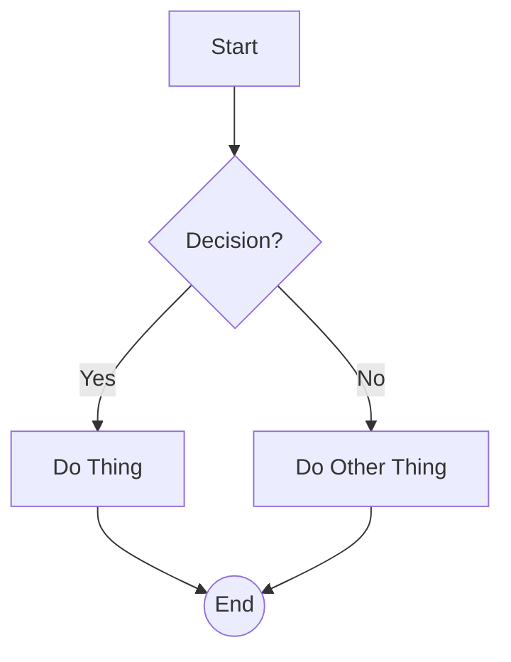
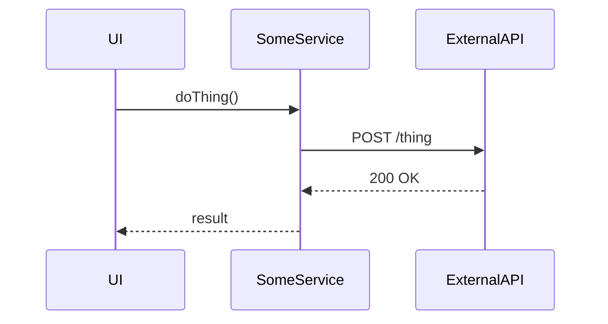

FIRST ORDER OF BUSINESS:
**READ THIS FIRST, MOTHERFUCKER, AND CONFIRM:** [hard-bob-workflow.mdc](../../../.cursor/rules/hard-bob-workflow.mdc)

# TODO: [Your Feature/Refactoring Title Here]

**Goal:** [Clearly articulate the **business objective** or **technical improvement** you're aiming for. What problem are we solving? Be specific, no fucking ambiguity. Think: "Allow users to remain logged in offline," not "Improve login."]

---

## Target Flow / Architecture (Optional but Recommended)

[Use Mermaid diagrams (```mermaid ... ```) or concise descriptions to illustrate the desired end state or key interactions. This forces clarity and surfaces bullshit assumptions early. Think sequence diagrams, flowcharts, or component diagrams.]

**Example Mermaid:**


**Example Sequence Diagram:**


---

**MANDATORY REPORTING RULE:** For **every** task/cycle below, **before check-off and moving on to the next todo**, the dev must (a) write a brief *Findings* paragraph summarizing *what was done and observed* and (b) a *Handover Brief* summarising status at the end of the cycle, edge-cases/gotchas, and next-step readiness **inside this doc** before ticking the checkbox. No silent check-offs allowed – uncertainty gets you fucking fired. Like Mafee forgetting the shorts, don't be that guy.

---

## Cycle 0: Setup & Prerequisite Checks (If Applicable)

**Goal** [Clearly articulate the goal of this specific cycle. WHAT & WHY!]

**MANDATORY REPORTING RULE:** After *each sub-task* below and *before* ticking its checkbox, you **MUST** add a **Findings** note *and* a **Handover Brief**. No silent check-offs. Uncertainty will get you fucking fired.

[Use this cycle for initial setup, dependency additions, or crucial research *before* the main TDD loops begin.]

* 0.1. [ ] **Task:** [e.g., Add Dependency `some_package`]
    * Action: [e.g., Run `flutter pub add some_package`]
    * Findings: [Record results, success/failure, version added]
* 0.2. [ ] **Task:** [e.g., Evaluate Existing `SomeClass` Interface]
    * Action: [e.g., Review code in `path/to/some_class.dart`, check relevant method signatures]
    * Findings: [Summarize findings, potential conflicts, decisions made, e.g., "Interface sufficient," or "Requires new method X"]
* 0.3. [ ] **Update Plan:** [Based on findings, confirm or adjust the plan for subsequent cycles.]
    * Findings: [e.g., "Plan confirmed," or "Cycle 2 needs to be split to handle interface change first."]
* 0.4. [ ] **Handover Brief:**
    * Status: [e.g., Setup complete, ready for Cycle 1.]
    * Gotchas: [Any surprises or potential issues discovered?]
    * Recommendations: [Proceed as planned? Adjustments needed?]

---

## Cycle 1: [Implement Core Feature X via TDD]

**Goal** [Clearly articulate the goal of this specific cycle. WHAT & WHY!]

**MANDATORY REPORTING RULE:** After *each sub-task* below and *before* ticking its checkbox, you **MUST** add a **Findings** note *and* a **Handover Brief** at the end of the cycle. No silent check-offs. Uncertainty will get you fucking fired.

[Focus on one logical piece of functionality per cycle. Follow the TDD rhythm religiously.]

* 1.1. [ ] **Research:** [Optional: Investigate specific APIs, libraries, or existing code needed for this cycle.]
    * Findings: [Document findings, relevant methods, potential challenges.]
* 1.2. [ ] **Tests RED:** [Write the unit or integration test(s) for the desired behavior. Be specific about what you're testing.]
    * Test File: [e.g., `test/feature/subfeature/some_service_test.dart`]
    * Test Description: [e.g., `should return cached data when network fails`, `throws SpecificException when input is invalid`]
    * Findings: [Confirm tests are written and fail as expected. Note any difficulties in writing the test.]
* 1.3. [ ] **Implement GREEN:** [Write the *minimum* amount of code to make the failing test(s) pass.]
    * Implementation File: [e.g., `lib/feature/subfeature/some_service_impl.dart`]
    * Findings: [Confirm code is written and tests now pass. Note any implementation challenges.]
* 1.4. [ ] **Refactor:** [Clean up the code and tests. Improve clarity, remove duplication, adhere to style guides.]
    * Findings: [Describe refactoring steps taken. Confirm tests still pass. Run `dart analyze` / `npm run lint` etc.]
* 1.5. [ ] **Run Cycle-Specific Tests:** [Execute relevant tests for *this cycle only*. Use the *correct* script.]
    * Command: [e.g., `./scripts/list_failed_tests.dart test/feature/subfeature/some_service_test.dart --except`]
    * Findings: [Confirm cycle-specific tests pass. List any failures and fixes if necessary.]
* 1.6. [ ] **Run ALL Unit/Integration Tests:**
    * Command: `./scripts/list_failed_tests.dart --except`
    * Findings: `[Confirm ALL unit/integration tests pass. FIX if not.]`
* 1.7. [ ] **Format, Analyze, and Fix:**
    * Command: `./scripts/fix_format_analyze.sh`
    * Findings: `[Confirm ALL formatting and analysis issues are fixed. FIX if not.]`
* 1.8. [ ] **Run ALL E2E & Stability Tests:**
    * Command: `./scripts/run_all_tests.sh`
    * Findings: `[Confirm ALL tests pass, including E2E and stability checks. FIX if not.]`
* 1.9. [ ] **Handover Brief:**
    * Status: [e.g., Core logic for Feature X implemented and tested.]
    * Gotchas: [Any tricky bits, edge cases encountered, or fragile tests?]
    * Recommendations: [Ready for Cycle 2 integration? Any follow-up needed?]

---

## Cycle 2: [Integrate Feature X with Feature Y / Implement Next Piece]

**Goal** [Clearly articulate the goal of this specific cycle. WHAT & WHY!]

**MANDATORY REPORTING RULE:** After *each sub-task* below and *before* ticking its checkbox, you **MUST** add a **Findings** note *and* a **Handover Brief** at the end of the cycle. No silent check-offs. Uncertainty will get you fucking fired.

[Repeat the TDD cycle structure. Focus on integration or the next logical step.]

* 2.1. [ ] **Research:** ...
    * Findings: ...
* 2.2. [ ] **Tests RED:** ...
    * Findings: ...
* 2.3. [ ] **Implement GREEN:** ...
    * Findings: ...
* 2.4. [ ] **Refactor:** ...
    * Findings: ...
* 2.5. [ ] **Run Cycle-Specific Tests:** ...
    * Findings: ...
* 2.6. [ ] **Run ALL Unit/Integration Tests:**
    * Command: `./scripts/list_failed_tests.dart --except`
    * Findings: `[Confirm ALL unit/integration tests pass. FIX if not.]`
* 2.7. [ ] **Format, Analyze, and Fix:**
    * Command: `./scripts/fix_format_analyze.sh`
    * Findings: `[Confirm ALL formatting and analysis issues are fixed. FIX if not.]`
* 2.8. [ ] **Run ALL E2E & Stability Tests:**
    * Command: `./scripts/run_all_tests.sh`
    * Findings: `[Confirm ALL tests pass, including E2E and stability checks. FIX if not.]`
* 2.9. [ ] **Handover Brief:**
    * Status: ...
    * Gotchas: ...
    * Recommendations: ...

---

## Cycle N: Final Polish, Documentation & Cleanup

**Goal** [Clearly articulate the goal of this specific cycle. WHAT & WHY, especially any gotchas and things to watch out for.]

**MANDATORY REPORTING RULE:** After *each sub-task* below and *before* ticking its checkbox, you **MUST** add a **Findings** note *and* a **Handover Brief** at the end of the cycle. No silent check-offs. Uncertainty will get you fucking fired.

[Use the final cycle(s) for documentation updates, removing dead code, final testing, and hardening.]

* N.1. [ ] **Task:** [e.g., Update Architecture Docs]
    * File: [e.g., `docs/features/feature-x-architecture.md`]
    * Findings: [Confirm docs reflect the final implementation.]
* N.2. [ ] **Task:** [e.g., Remove Deprecated `OldComponent`]
    * Action: [e.g., Delete file, update references.]
    * Findings: [Confirm removal and that no build errors occur.]
* N.3. [ ] **Run ALL Unit/Integration Tests:**
    * Command: `./scripts/list_failed_tests.dart --except`
    * Findings: `[Confirm ALL unit/integration tests pass. FIX if not.]`
* N.4. [ ] **Format, Analyze, and Fix:**
    * Command: `./scripts/fix_format_analyze.sh`
    * Findings: `[Confirm ALL formatting and analysis issues are fixed. FIX if not.]`
* N.5. [ ] **Run ALL E2E & Stability Tests:**
    * Command: `./scripts/run_all_tests.sh`
    * Findings: `[Confirm ALL tests pass, including E2E and stability checks. FIX if not.]`
* N.6. [ ] **Manual Smoke Test:** [If applicable, perform a quick E2E check of the feature.]
    * Findings: [Describe test steps and results.]
* N.7. [ ] **Code Review & Commit Prep:** [Review staged changes (`git diff --staged | cat`), ensure adherence to guidelines.]
    * Findings: [Confirm code is clean, follows principles, ready for Hard Bob Commit.]
* N.8. [ ] **Handover Brief:**
    * Status: [e.g., Feature complete, tested, documented, ready for commit.]
    * Gotchas: [Any final caveats or observations?]
    * Recommendations: [Merge it, ship it, or burn it?]

---

## DONE

[Summarize the key accomplishments once all cycles are complete.]

With these cycles we:
1. [Accomplishment 1, e.g., Implemented offline caching for user profiles.]
2. [Accomplishment 2, e.g., Added global offline UI banner.]
3. [Accomplishment 3, e.g., Ensured job sync respects offline state.]

No bullshit, no uncertainty – [Insert appropriate Billions closing quote, e.g., "Dollar Bill would be proud."] 