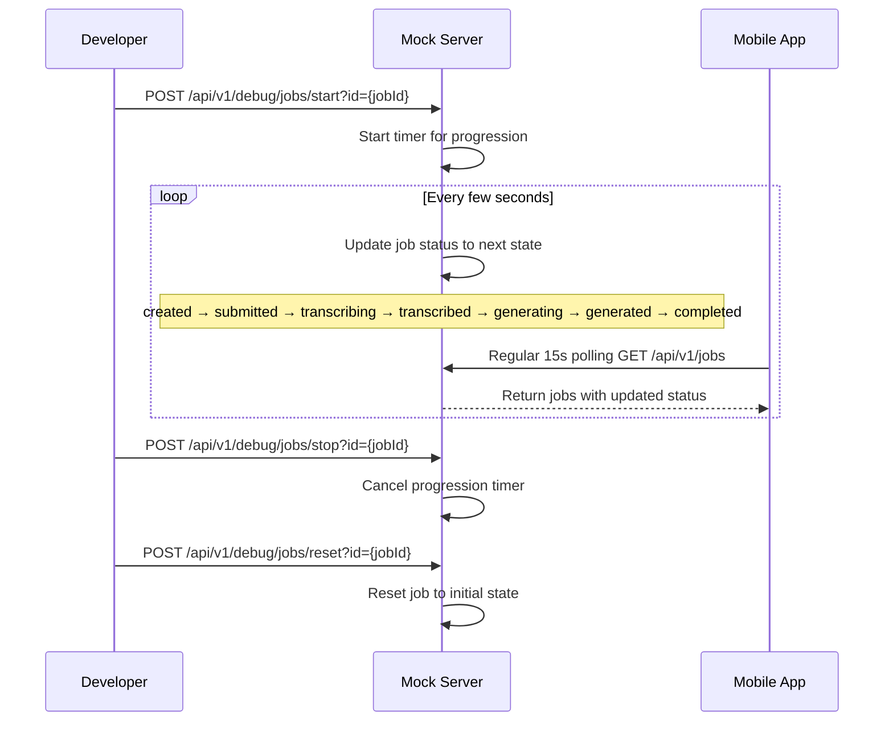

FIRST ORDER OF BUSINESS:
**READ THIS FIRST, MOTHERFUCKER, AND CONFIRM:** [hard-bob-workflow.mdc](../../../.cursor/rules/hard-bob-workflow.mdc)

# TODO: Implement Job Progression Simulation in Mock API Server

**Goal:** Extend the mock API server to simulate job status progression through all states, allowing developers to test the app's handling of job state transitions without needing the full AI pipeline. This should work with the existing 15-second job polling mechanism.

---

## Target Flow

---

## Cycle 0: Planning & Research

* 0.0. [x] **READ THIS FIRST, MOTHERFUCKER, AND CONFIRM:** [hard-bob-workflow.mdc](../../../.cursor/rules/hard-bob-workflow.mdc)

* 0.1. [x] **Task:** Review existing mock server implementation
    * Action: Examine server.dart, especially job creation and update endpoints
    * Findings: 
        * Uses `shelf` + `shelf_router` for routing.
        * Stores jobs in-memory: `_jobs` (`List<Map<String, dynamic>>`).
        * Has standard CRUD endpoints for `/api/v1/jobs`.
        * `_createJobHandler` likely sets initial status (needs confirmation).
        * `_updateJobHandler` allows patching job fields (e.g., name).
        * **No existing automatic status progression logic or timers.**

* 0.2. [x] **Task:** Identify job status progression sequence
    * Action: Review JobStatus enum and feature documentation
    * Findings: 
        * Found `JobStatus` enum in `lib/features/jobs/domain/entities/job_status.dart`.
        * Confirmed sequence matches TODO: `created` -> `submitted` -> `transcribing` -> `transcribed` -> `generating` -> `generated` -> `completed`.
        * Note: An `error` state also exists, but isn't part of the standard happy path progression.

* 0.3. [x] **Task:** Plan required endpoints and functionality
    * Action: Define the endpoint structure and parameters
    * Findings: 
        * Endpoints defined in TODO are suitable:
            * `POST /api/v1/debug/jobs/start?id={jobId}`
            * `POST /api/v1/debug/jobs/stop?id={jobId}`
            * `POST /api/v1/debug/jobs/reset?id={jobId}`
        * Requires managing per-job `Timer.periodic` instances.
        * Timer updates job status in `_jobs` following the sequence.
        * Need to handle timer creation, cancellation (on stop/reset/delete), and storage.
        * Existing `GET /api/v1/jobs` will show progression.

* 0.4. [x] **Handover Brief:**
    * Status: Planning & Research (Cycle 0) complete.
    * Gotchas: 
        * Timer management requires care (start/stop/reset/delete interactions).
        * Need to confirm/set initial status (`created`) and reset status (`created`).
    * Recommendations: 
        * Proceed to Cycle 1.
        * Implement `start` endpoint and timer logic first.
        * Use a default interval (e.g., 3-5s) between status updates.

---

## Cycle 1: Implement Basic Job Progression

* 1.1. [ ] **Research:** Investigate Dart timer mechanisms and state management
    * Findings: 

* 1.2. [ ] **Tests RED:** Create tests for new endpoints
    * Test Description: Tests should verify job progression through all states
    * Findings: 

* 1.3. [ ] **Implement GREEN:** Add debug endpoints and progression logic
    * Implementation: Add progression timer management and state transition logic
    * Findings: 

* 1.4. [ ] **Refactor:** Clean up code and improve error handling
    * Findings: 

* 1.5. [ ] **Test:** Verify functionality with curl/Postman
    * Command: `curl -X POST "http://localhost:8080/api/v1/debug/jobs/start?id={jobId}" -H "X-API-Key: test-api-key"`
    * Run dart fix --apply && ./scripts/format.sh
    * Run and fix: ./scripts/list_failed_tests.dart --except
    * Findings: 

* 1.6. [ ] **Handover Brief:**
    * Status: 
    * Gotchas: 
    * Recommendations: 

---

## Cycle 2: Add Reset and Enhance Features

* 2.1. [ ] **Research:** Identify realistic timing between job states
    * Findings: 

* 2.2. [ ] **Tests RED:** Add tests for reset functionality
    * Test Description: Verify that jobs can be reset to initial state
    * Findings: 

* 2.3. [ ] **Implement GREEN:** Add reset functionality and polish
    * Implementation: Add reset endpoint and improve logging
    * Findings: 

* 2.4. [ ] **Refactor:** Ensure clean code and consistent logging
    * Findings: 

* 2.5. [ ] **Test:** Verify all functionality with curl/Postman
    * Command: `curl -X POST "http://localhost:8080/api/v1/debug/jobs..." -H "X-API-Key: test-api-key"`
    * Run dart fix --apply && ./scripts/format.sh
    * Run and fix: ./scripts/list_failed_tests.dart --except
    * Findings: 

* 2.6. [ ] **Handover Brief:**
    * Status: 
    * Gotchas: 
    * Recommendations: 

---

## DONE

With these cycles we:
1. Extended the mock server with job progression simulation
2. Added control endpoints to start, stop, and reset job progression
3. Enabled testing of the full job lifecycle without needing the AI pipeline

No bullshit, no uncertainty – like Axe says, "When you have nothing to hide, you hide nothing." 