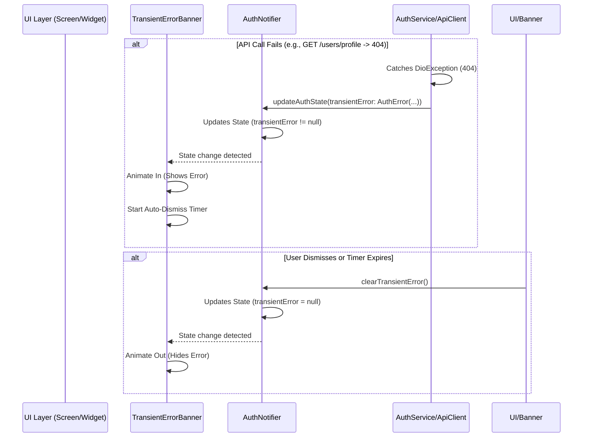

FIRST ORDER OF BUSINESS:
**READ THIS FIRST, MOTHERFUCKER, AND CONFIRM:** [hard-bob-workflow.mdc](../../../.cursor/rules/hard-bob-workflow.mdc)

# TODO: Add Transient Error Banner & Fix Safe Areas

**Goal:** Prevent the app from becoming unresponsive (e.g., endless spinner) due to non-critical API errors like the 404 on `/users/profile` during login/refresh. Implement a transient, dismissible error banner to inform the user without halting the app. Additionally, fix the existing `OfflineBanner` so it doesn't render behind the iOS notch/island.

---

## Target Flow / Architecture

Error originates in Service/Client layer, propagates via Notifier state, displayed by dedicated UI banner.

---

**MANDATORY REPORTING RULE:** For **every** task/cycle below, **before check-off and moving on to the next todo**, the dev must (a) write a brief *Findings* paragraph summarizing *what was done and observed* and (b) a *Handover Brief* summarising status, edge-cases/gotchas, and next-step readiness **inside this doc** before ticking the checkbox. No silent check-offs allowed – uncertainty gets you fucking fired. Like Mafee forgetting the shorts, don't be that guy.

---

## Cycle 0: Setup & Prerequisite Checks

*No specific setup anticipated. Proceed directly to Cycle 1.*

---

## Cycle 1: Fix OfflineBanner SafeArea

**MANDATORY REPORTING RULE:** After *each sub-task* below and *before* ticking its checkbox, you **MUST** add a **Findings** note *and* a **Handover Brief**. No silent check-offs. Uncertainty will get you fucking fired.

* 1.1. [ ] **Tests RED:** Write/modify a widget test for `OfflineBanner` to verify its content renders *under* the top system UI (e.g., notch/island). Expect it to fail initially.
    * Test File: `test/core/auth/presentation/widgets/offline_banner_test.dart` (Create if needed)
    * Test Description: `should render content below top safe area padding`
    * Findings:
* 1.2. [ ] **Implement GREEN:**
- ~~Wrap the `OfflineBanner`'s content (`Center` containing the `Row`) with a `SafeArea` widget, specifically enabling `top: true`.~~
- **Wrap _the entire banner container_ (the `AnimatedContainer`) in `SafeArea(top: true)`, or alternatively remove the fixed `OfflineBannerTheme.height` and let the banner use `minHeight` so the SafeArea padding doesn't clip the content.**
    * Implementation File: `lib/core/auth/presentation/widgets/offline_banner.dart`
    * Findings:
* 1.3. [ ] **Refactor:** Ensure clean implementation.
    * Findings:
* 1.4. [ ] **Run Cycle-Specific Tests:**
    * Command: `./scripts/list_failed_tests.dart test/core/auth/presentation/widgets/offline_banner_test.dart --except`
    * Findings:
* 1.5. [ ] **Run ALL Unit/Integration Tests:**
    * Command: `./scripts/list_failed_tests.dart --except`
    * Findings:
* 1.6. [ ] **Format, Analyze, and Fix:**
    * Command: `dart fix --apply && ./scripts/format.sh && dart analyze`
    * Findings:
* 1.7. [ ] **Run ALL E2E & Stability Tests:**
    * Command: `./scripts/run_all_tests.sh`
    * Findings: `[Confirm visual fix on device if possible]`
* 1.8. [ ] **Handover Brief:**
    * Status: `OfflineBanner` safe area issue addressed and tested.
    * Gotchas:
    * Recommendations: Proceed to Cycle 2.

---

## Cycle 2: Introduce Error State & Auth Handling Logic

**MANDATORY REPORTING RULE:** After *each sub-task* below and *before* ticking its checkbox, you **MUST** add a **Findings** note *and* a **Handover Brief**. No silent check-offs. Uncertainty will get you fucking fired.

* 2.1. [ ] **Tests RED:**
    * Modify `AuthState` tests (if any) or `AuthNotifier` tests.
    * Add test case to `AuthNotifier` tests: Mock `AuthService.getUserProfile` to throw a `DioException` (e.g., 404 status). Verify that the resulting `AuthState` contains a non-null `transientError` property (newly added) and `isAuthenticated` might be false or unchanged depending on desired flow, but definitely not stuck loading. Add test for clearing the error.
    * Test File: `test/core/auth/presentation/auth_notifier_test.dart`
    * Findings:
* 2.2. [ ] **Implement GREEN:**
- ~~Add `AuthError? transientError;` (or similar structure) to `AuthState`~~
- **Introduce a lightweight `TransientError` model** (`lib/core/auth/transient_error.dart`) with at minimum `String message` and `AuthErrorType type`.
- Add `TransientError? transientError` to `AuthState` (`lib/core/auth/presentation/auth_state.dart`). Update constructors, `copyWith`, and `props`.
- In `AuthNotifier` (`lib/core/auth/presentation/auth_notifier.dart`):
  - Add `void clearTransientError()` that `copyWith`s the state so `transientError` becomes `null`.
  - In the `catch` blocks that handle `DioException` / `AuthException` coming from **_service calls_**, set `transientError` on the state **right here**. _Do **not** couple_ `AuthServiceImpl` to the notifier.
- Unit tests: adjust builders to accommodate the new field; add new red→green test cases for `transientError` population & clearing.
    * Implementation File(s):
        * `lib/core/auth/presentation/auth_state.dart`
        * `lib/core/auth/presentation/auth_notifier.dart`
        * `lib/core/auth/application/auth_service_impl.dart`
    * Findings:
* 2.3. [ ] **Refactor:** Clean up error handling logic, ensure state updates are clean.
    * Findings:
* 2.4. [ ] **Run Cycle-Specific Tests:**
    * Command: `./scripts/list_failed_tests.dart test/core/auth/presentation/auth_notifier_test.dart test/core/auth/application/auth_service_impl_test.dart --except`
    * Findings:
* 2.5. [ ] **Run ALL Unit/Integration Tests:**
    * Command: `./scripts/list_failed_tests.dart --except`
    * Findings:
* 2.6. [ ] **Format, Analyze, and Fix:**
    * Command: `dart fix --apply && ./scripts/format.sh && dart analyze`
    * Findings:
* 2.7. [ ] **Run ALL E2E & Stability Tests:**
    * Command: `./scripts/run_all_tests.sh`
    * Findings: `[App should not hang on profile 404, though no visual error yet]`
* 2.8. [ ] **Handover Brief:**
    * Status: Auth state now includes transient errors; service layer populates this state on specific API failures instead of crashing/hanging.
    * Gotchas: Decide which specific DioExceptions should trigger the banner.
    * Recommendations: Proceed to Cycle 3 to build the UI banner.

---

## Cycle 3: Implement TransientErrorBanner Widget

**MANDATORY REPORTING RULE:** After *each sub-task* below and *before* ticking its checkbox, you **MUST** add a **Findings** note *and* a **Handover Brief**. No silent check-offs. Uncertainty will get you fucking fired.

* 3.1. [ ] **Tests RED:** Create widget tests for the new `TransientErrorBanner`.
    * Test cases:
        * `renders nothing when transientError is null`
        * `renders correctly and is visible when transientError is not null`
        * `content respects top safe area`
        * `calls clearTransientError on AuthNotifier when dismiss button tapped`
        * `calls clearTransientError on AuthNotifier after timeout`
    * Test File: `test/core/common/widgets/transient_error_banner_test.dart` (or similar location)
    * Findings:
* 3.2. [ ] **Implement GREEN:** Create the `TransientErrorBanner` widget.
- **Make it a `ConsumerStatefulWidget`** (needs `initState`/`dispose` to manage auto-dismiss timer).
- Watch `authNotifierProvider.select((s) => s.transientError)`.
- Use `AnimatedContainer`/`AnimatedOpacity` for show/hide.
- **Wrap the whole banner in `SafeArea(top: true, bottom: false)`**, NOT just the inner row.
    * Create `lib/core/common/widgets/transient_error_banner.dart`.
    * Make it a `ConsumerWidget`.
    * Style similarly to `OfflineBanner` but maybe different color (e.g., warning yellow/red).
    * Display error message from `transientError.message`.
    * Add a dismiss button (`IconButton` with `CupertinoIcons.xmark`?) that calls `ref.read(authNotifierProvider.notifier).clearTransientError()`.
    * Implement `initState` with a `Timer` that calls `clearTransientError()` after ~5 seconds. Cancel timer in `dispose` and if dismissed manually.
    * Implementation File: `lib/core/common/widgets/transient_error_banner.dart`
    * Findings:
* 3.3. [ ] **Refactor:** Clean up widget code, extract constants/theme data if needed.
    * Findings:
* 3.4. [ ] **Run Cycle-Specific Tests:**
    * Command: `./scripts/list_failed_tests.dart test/core/common/widgets/transient_error_banner_test.dart --except`
    * Findings:
* 3.5. [ ] **Run ALL Unit/Integration Tests:**
    * Command: `./scripts/list_failed_tests.dart --except`
    * Findings:
* 3.6. [ ] **Format, Analyze, and Fix:**
    * Command: `dart fix --apply && ./scripts/format.sh && dart analyze`
    * Findings:
* 3.7. [ ] **Run ALL E2E & Stability Tests:**
    * Command: `./scripts/run_all_tests.sh`
    * Findings: `[Banner not visible yet as it's not integrated]`
* 3.8. [ ] **Handover Brief:**
    * Status: `TransientErrorBanner` widget created and tested in isolation. Handles state changes, dismissal, timer, and safe area.
    * Gotchas: Styling needs final decision. Timer duration might need tuning.
    * Recommendations: Proceed to Cycle 4 for integration.

---

## Cycle 4: Integrate Banner & Final Polish

**MANDATORY REPORTING RULE:** After *each sub-task* below and *before* ticking its checkbox, you **MUST** add a **Findings** note *and* a **Handover Brief**. No silent check-offs. Uncertainty will get you fucking fired.

* 4.1. [ ] **Task:** Integrate `TransientErrorBanner` into the main UI scaffold.
- Embed it in a `Stack` (or another `Column` slot) **directly above or below the `OfflineBanner`** so simultaneous banners don't produce unwanted layout shifts. Update `lib/core/auth/presentation/widgets/app_shell.dart` or the central scaffold accordingly.
    * Place the `<TransientErrorBanner />` widget in the appropriate place in your main app layout (e.g., inside a `Stack` in `app.dart` or your main `Scaffold`, likely just below the `OfflineBanner`).
    * File: e.g., `lib/app/view/app.dart` or main screen scaffold file.
    * Findings:
* 4.2. [ ] **Task:** Refine error messages (optional).
    * Ensure the messages displayed from `AuthError` are user-friendly.
    * Findings:
* 4.3. [ ] **Run ALL Unit/Integration Tests:**
    * Command: `./scripts/list_failed_tests.dart --except`
    * Findings:
* 4.4. [ ] **Format, Analyze, and Fix:**
    * Command: `dart fix --apply && ./scripts/format.sh && dart analyze`
    * Findings:
* 4.5. [ ] **Run ALL E2E & Stability Tests:**
    * Command: `./scripts/run_all_tests.sh`
    * Findings:
* 4.6. [ ] **Manual Smoke Test:** Trigger the error condition (requires backend staging to still 404 on `/users/profile` after login/refresh, or modify client code temporarily to simulate).
    * Steps: Log in. Verify the error banner appears briefly after the failed profile fetch, then disappears. Verify the app remains responsive (not stuck on spinner). Verify `OfflineBanner` looks correct with safe area.
    * Findings:
* 4.7. [ ] **Code Review & Commit Prep:** `git status | cat && git diff --staged | cat`
    * Review all changes: `OfflineBanner` fix, `AuthState`, `AuthNotifier`, `AuthServiceImpl` error handling, `TransientErrorBanner` widget, UI integration.
    * Findings:
* 4.8. [ ] **Handover Brief:**
    * Status: Transient error handling and banner implemented, integrated, and tested. `OfflineBanner` safe area fixed. Ready for commit after manual smoke test confirmation.
    * Gotchas: Manual test depends on staging environment state or requires temporary code modification.
    * Recommendations: Perform smoke test, then commit.

---

## DONE

With these cycles we:
1. Fixed the `OfflineBanner` rendering issue behind the device notch/island.
2. Implemented a mechanism (`transientError` in `AuthState`) to handle specific API errors gracefully.
3. Modified authentication logic (`AuthServiceImpl`) to catch relevant errors (like 404 on profile fetch) and update the error state instead of hanging.
4. Created a `TransientErrorBanner` widget that displays these errors temporarily and respects safe areas.
5. Integrated the banner into the UI, ensuring users are informed of non-critical errors without the app becoming unresponsive.

"This is how we ensure the app doesn't take a shit when the backend hiccups. We're building a fortress, not a lean-to." 