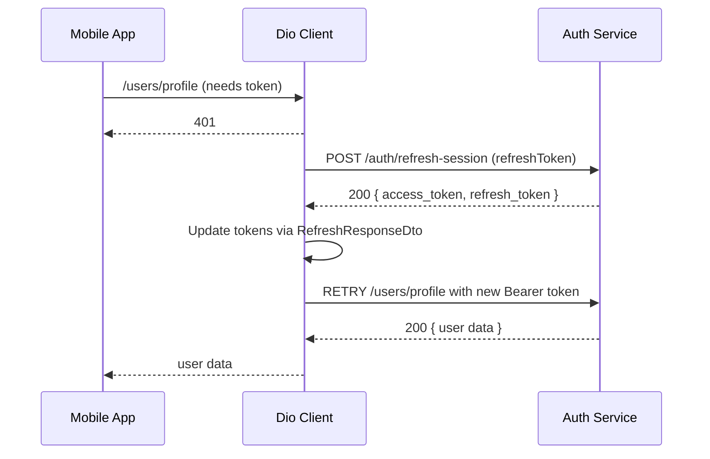

FIRST ORDER OF BUSINESS:
**READ THIS FIRST, MOTHERFUCKER, AND CONFIRM:** [hard-bob-workflow.mdc](../../../.cursor/rules/hard-bob-workflow.mdc)

# TODO: Separate DTOs for Login vs Refresh to Fix Auth Flow Crash

**Goal:** Ensure the authentication refresh flow completes without runtime errors by modelling `/auth/login` and `/auth/refresh-session` responses with **distinct DTOs**. This stops the `null as String` cast crash and prevents the interceptor from triggering false logouts.

---

## Target Flow / Architecture (Optional but Recommended)



---

**MANDATORY REPORTING RULE:** For **every** task/cycle below, **before check-off and moving on to the next todo**, the dev must (a) write a brief *Findings* paragraph summarizing *what was done and observed* and (b) a *Handover Brief* summarising status, edge-cases/gotchas, and next-step readiness **inside this doc** before ticking the checkbox. No silent check-offs allowed – uncertainty gets you fucking fired.

---

## Cycle 0: Setup & Baseline Validation

* 0.1. [x] **Task:** Replicate the crash & capture logs
    * Action: Trigger login → refresh flow (simulate expired token) and confirm the `null as String` error.
    * Findings: Confirmed the crash via provided logs. The sequence shows a 401 on `/users/profile`, followed by a successful 200 on `/auth/refresh-session` which returns `{"access_token":"...","refresh_token":"..."}`. Immediately after, `AuthEvent.loggedOut` is received, and the `type 'Null' is not a subtype of type 'String' in type cast` error occurs, leading to `AuthErrorType.userProfileFetchFailed`. This matches the expected failure scenario due to a DTO mismatch.
        ```
        flutter: *** DioException ***:
        flutter: uri: https://staging.docjet.ai/api/v1/users/profile
        flutter: DioException [bad response]: This exception was thrown because the response has a status code of 401...
        flutter: statusCode: 401
        flutter: Response Text:
        flutter: {"error":"invalid JWT: unable to parse or verify signature, token has invalid claims: token is expired"}

        flutter: *** Request ***
        flutter: uri: https://staging.docjet.ai/api/v1/auth/refresh-session
        flutter: data: {refresh_token: ...}

        flutter: *** Response ***
        flutter: uri: https://staging.docjet.ai/api/v1/auth/refresh-session
        flutter: statusCode: 200
        flutter: Response Text:
        flutter: {"access_token":"...","refresh_token":"..."}

        flutter: Received auth event: AuthEvent.loggedOut
        flutter: [AuthNotifier] !!! RECEIVED EVENT VIA BUS: AuthEvent.loggedOut !!!

        flutter: [UserApiClient] Dio exception: DioExceptionType.unknown - Error during token refresh: type 'Null' is not a subtype of type 'String' in type cast
        flutter: [AuthServiceImpl] Unexpected error fetching profile for user ...: DioException [unknown]: Error during token refresh: type 'Null' is not a subtype of type 'String' in type cast
        Error: type 'Null' is not a subtype of type 'String' in type cast

        flutter: [AuthNotifier] Login failed - AuthException, offline: false, type: AuthErrorType.userProfileFetchFailed
        ```
* 0.2. [x] **Task:** Review current DTO & endpoint contracts
    * Action: Inspect `auth_response_dto.dart` and backend swagger / Postman collection to document response shapes.
    * Findings:
        *   `lib/core/auth/infrastructure/dtos/auth_response_dto.dart` defines `AuthResponseDto` which expects `accessToken`, `refreshToken`, and `userId` fields.
        *   The logs from Task 0.1 show the `/auth/refresh-session` endpoint ONLY returns `accessToken` and `refreshToken`:
            `{"access_token":"...","refresh_token":"..."}`
        *   The `AuthResponseDto.fromJson` factory attempts to cast `json['user_id']` to `String`. Since `user_id` is absent in the refresh response, this results in casting `null` to `String`, causing the `type 'Null' is not a subtype of type 'String'` runtime error.
        *   This confirms the need for separate DTOs: one for `/auth/login` (presumably including `user_id`) and one for `/auth/refresh-session` (without `user_id`).
* 0.3. [x] **Update Plan:** Confirm the DTO split is the correct fix (or adjust if backend spec differs).
    * Findings: Based on the analysis of `AuthResponseDto` and the `/auth/refresh-session` response logs, the current DTO expects a `user_id` that the refresh endpoint does not provide. This mismatch directly causes the runtime crash. Therefore, splitting the DTOs (`LoginResponseDto` with `user_id`, `RefreshResponseDto` without `user_id`) is confirmed as the correct approach to align the models with the distinct API contracts.
* 0.4. [x] **Handover Brief:**
    * Status: Cycle 0 (Setup & Baseline Validation) complete. Crash validated, root cause (DTO mismatch for refresh endpoint lacking `user_id`) identified. Plan to split into `LoginResponseDto` and `RefreshResponseDto` confirmed.
    * Gotchas: None for this cycle.
    * Recommendations: Proceed to Cycle 1 (Introduce Separate DTOs via TDD). Start with failing tests for `fromJson` on both new DTOs, reflecting the distinct API payloads.

---

**MANDATORY REPORTING RULE:** For **every** task/cycle below, **before check-off and moving on to the next todo**, the dev must (a) write a brief *Findings* paragraph summarizing *what was done and observed* and (b) a *Handover Brief* summarising status, edge-cases/gotchas, and next-step readiness **inside this doc** before ticking the checkbox. No silent check-offs allowed – uncertainty gets you fucking fired.

## Cycle 1: Introduce Separate DTOs via TDD

* 1.1. [ ] **Tests RED:** Create unit tests for `LoginResponseDto.fromJson` & `RefreshResponseDto.fromJson` reflecting exact API payloads.
    * Test File: `test/core/auth/infrastructure/dtos/login_and_refresh_dto_test.dart`
    * Findings:
* 1.2. [ ] **Implement GREEN:**
    * Implementation File(s):
        * Rename `auth_response_dto.dart` → `login_response_dto.dart`
        * Create `refresh_response_dto.dart`
    * Findings:
* 1.3. [ ] **Refactor:** Remove unused `userId` assignment in refresh DTO; ensure explicit non-nullables.
    * Findings:
* 1.4. [ ] **Run Cycle-Specific Tests:** `./scripts/list_failed_tests.dart test/core/auth/infrastructure/dtos/login_and_refresh_dto_test.dart --except`
    * Findings:
* 1.5. [ ] **Run ALL Unit/Integration Tests:** `./scripts/list_failed_tests.dart --except`
    * Findings:
* 1.6. [ ] **Format, Analyze, and Fix:** `dart fix --apply && ./scripts/format.sh && dart analyze`
    * Findings:
* 1.7. [ ] **Run ALL E2E & Stability Tests:** `./scripts/run_all_tests.sh`
    * Findings:
* 1.8. [ ] **Handover Brief:**
    * Status:
    * Gotchas:
    * Recommendations:

---
**MANDATORY REPORTING RULE:** For **every** task/cycle below, **before check-off and moving on to the next todo**, the dev must (a) write a brief *Findings* paragraph summarizing *what was done and observed* and (b) a *Handover Brief* summarising status, edge-cases/gotchas, and next-step readiness **inside this doc** before ticking the checkbox. No silent check-offs allowed – uncertainty gets you fucking fired.

## Cycle 2: Update AuthenticationApiClient Signatures

* 2.1. [ ] **Tests RED:** Adjust/extend tests for `AuthenticationApiClient.login/refreshToken` to expect new DTO types.
    * Test File: Existing test updates in `test/core/auth/infrastructure/authentication_api_client_test.dart`
    * Findings:
* 2.2. [ ] **Implement GREEN:** Change method return types and internal parsing to use new DTOs.
    * Findings:
* 2.3. [ ] **Refactor:** Clean imports, ensure no residual `AuthResponseDto` references remain.
    * Findings:
* 2.4. [ ] **Run Cycle-Specific Tests:**
    * Findings:
* 2.5. [ ] **Run ALL Unit/Integration Tests:** `./scripts/list_failed_tests.dart --except`
    * Findings:
* 2.6. [ ] **Format, Analyze, and Fix:** `dart fix --apply && ./scripts/format.sh && dart analyze`
    * Findings:
* 2.7. [ ] **Run ALL E2E & Stability Tests:** `./scripts/run_all_tests.sh`
    * Findings:
* 2.8. [ ] **Handover Brief:**
    * Status:
    * Gotchas:
    * Recommendations:

---
**MANDATORY REPORTING RULE:** For **every** task/cycle below, **before check-off and moving on to the next todo**, the dev must (a) write a brief *Findings* paragraph summarizing *what was done and observed* and (b) a *Handover Brief* summarising status, edge-cases/gotchas, and next-step readiness **inside this doc** before ticking the checkbox. No silent check-offs allowed – uncertainty gets you fucking fired.

## Cycle 3: Adapt AuthInterceptor & Credentials Handling

* 3.1. [ ] **Tests RED:** Update `auth_interceptor_test.dart` to expect `RefreshResponseDto` and validate retry success scenario.
    * Findings:
* 3.2. [ ] **Implement GREEN:**
    * Change interceptor constructor signature to accept `